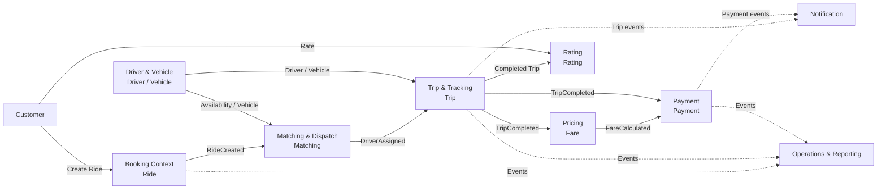

# CAB System – DDD từ SSR

## 1. Mục tiêu

Tài liệu này chuyển đổi các SSR/Use Case trong README/BA ban đầu của CAB System thành mô hình Domain-Driven Design (DDD), tập trung vào:

- Bounded Context / Sub-domain
- Aggregate Root
- Entity
- Value Object
- Domain Service
- Domain Event
- Quan hệ giữa các bounded context
- Định hướng High Cohesion – Loose Coupling cho microservice

> Phạm vi chỉ dựa trên các nghiệp vụ đã có trong README/BA ban đầu của CAB System. Những thành phần không được đặc tả rõ trong nguồn được xem là đề xuất mô hình hóa, không phải yêu cầu nghiệp vụ mới.

---

## 2. Phân rã Bounded Context

| #  | Bounded Context        | Trách nhiệm chính                                                | Loại              |
| -- | ---------------------- | ------------------------------------------------------------------- | ------------------ |
| 1  | Identity & Access      | Đăng ký, đăng nhập, đăng xuất, xác thực                  | Generic            |
| 2  | Customer               | Quản lý hồ sơ khách hàng                                      | Supporting         |
| 3  | Driver & Vehicle       | Hồ sơ tài xế, trạng thái sẵn sàng, phương tiện, vị trí | Supporting         |
| 4  | Booking                | Đặt xe, hủy yêu cầu đặt xe                                   | Core               |
| 5  | Matching & Dispatch    | Tìm và phân công tài xế, xử lý nhận/từ chối/timeout      | Core               |
| 6  | Trip & Tracking        | Quản lý vòng đời chuyến và theo dõi vị trí                | Core               |
| 7  | Pricing                | Tính cước                                                        | Supporting         |
| 8  | Payment                | Thanh toán tiền mặt/điện tử                                   | Supporting         |
| 9  | Notification           | Gửi thông báo                                                    | Generic/Supporting |
| 10 | Rating                 | Đánh giá tài xế sau chuyến                                    | Supporting         |
| 11 | Operations & Reporting | Xử lý sự cố, giám sát và báo cáo                           | Supporting         |

---

## 3. Bảng chuyển đổi SSR → DDD

| SSR / Use Case                      | Bounded Context     | Aggregate Root / Entity chính | Value Object                                         | Domain Service / Logic        |
| ----------------------------------- | ------------------- | ------------------------------ | ---------------------------------------------------- | ----------------------------- |
| Đăng ký                          | Identity & Access   | `User`                       | `Phone`, `Email`, `Credentials`                | `RegistrationService`       |
| Đăng nhập                        | Identity & Access   | `User`, `AuthSession`      | `Credentials`                                      | `AuthenticationService`     |
| Đăng xuất                        | Identity & Access   | `AuthSession`                | —                                                   | `LogoutService`             |
| Xem/cập nhật hồ sơ khách hàng | Customer            | `Customer`                   | `CustomerProfile`                                  | `CustomerService`           |
| Xem/cập nhật hồ sơ tài xế     | Driver & Vehicle    | `Driver`                     | `DriverProfile`                                    | `DriverService`             |
| Quản lý phương tiện            | Driver & Vehicle    | `Driver`, `Vehicle`        | `LicensePlate`, `VehicleType`                    | `VehicleService`            |
| Cập nhật trạng thái sẵn sàng  | Driver & Vehicle    | `Driver`                     | `DriverAvailability`                               | `DriverAvailabilityService` |
| Cập nhật vị trí tài xế        | Driver & Vehicle    | `DriverLocation`             | `GeoLocation`                                      | `LocationTrackingService`   |
| Đặt xe                            | Booking             | `Ride`                       | `PickupPoint`, `Destination`, `ServiceType`    | `BookingService`            |
| Hủy đặt xe                       | Booking             | `Ride`                       | `CancellationReason`                               | `CancellationService`       |
| Tìm tài xế                       | Matching & Dispatch | `Matching`                   | `MatchingCriteria`                                 | `DriverMatchingService`     |
| Phân công tài xế                | Matching & Dispatch | `Matching`                   | `DriverAssignment`                                 | `DispatchService`           |
| Tài xế nhận/từ chối chuyến    | Matching & Dispatch | `Matching`                   | `DriverResponse`                                   | `DriverResponseService`     |
| Cập nhật trạng thái chuyến     | Trip & Tracking     | `Trip`                       | `TripStatus`                                       | `TripLifecycleService`      |
| Theo dõi chuyến/vị trí          | Trip & Tracking     | `Trip`, `TripLocation`     | `GeoLocation`, `Distance`, `Duration`          | `TripTrackingService`       |
| Tính cước                        | Pricing             | `Fare`                       | `FareComponent`, `Money`                         | `FareCalculationService`    |
| Thanh toán                         | Payment             | `Payment`                    | `Money`, `PaymentMethod`, `PaymentStatus`      | `PaymentService`            |
| Thanh toán điện tử              | Payment             | `PaymentTransaction`         | `TransactionReference`                             | `ElectronicPaymentService`  |
| Xác nhận tiền mặt               | Payment             | `Payment`                    | `Money`                                            | `CashPaymentService`        |
| Gửi thông báo                    | Notification        | `Notification`               | `NotificationType`, `Message`, `Channel`       | `NotificationService`       |
| Đánh giá tài xế                | Rating              | `Rating`                     | `RatingScore`, `Comment`                         | `RatingService`             |
| Giám sát/xử lý sự cố          | Operations          | `Incident`                   | `IncidentType`, `IncidentStatus`, `Resolution` | `IncidentHandlingService`   |
| Báo cáo chuyến                   | Reporting           | `TripReport`                 | `ReportPeriod`                                     | `TripReportService`         |
| Báo cáo doanh thu                 | Reporting           | `RevenueReport`              | `Money`, `ReportPeriod`                          | `RevenueReportService`      |
| Báo cáo hủy                      | Reporting           | `CancellationReport`         | `ReportPeriod`                                     | `CancellationReportService` |
| Báo cáo tài xế                  | Reporting           | `DriverReport`               | `ReportPeriod`                                     | `DriverReportService`       |

---

## 4. Aggregate chính

### 4.1 Identity & Access

```text
User
└── AuthSession
```

`User` là Aggregate Root cho thông tin tài khoản/xác thực.

### 4.2 Customer

```text
Customer
└── CustomerProfile
```

`Customer` là Aggregate Root.

### 4.3 Driver & Vehicle

```text
Driver
├── DriverProfile
├── DriverAvailability
├── DriverLocation
└── Vehicle
```

`Driver` là Aggregate Root trong phạm vi context này.

### 4.4 Booking

```text
Ride
├── PickupPoint
├── Destination
├── ServiceType
└── CancellationReason
```

`Ride` là Aggregate Root.

### 4.5 Matching & Dispatch

```text
Matching
├── MatchingCriteria
├── DriverAssignment
└── DriverResponse
```

`Matching` là Aggregate Root.

Ví dụ một yêu cầu có thể có nhiều lần đề xuất:

```text
Matching
├── Driver D01 → REJECTED
├── Driver D02 → TIMEOUT
└── Driver D03 → ACCEPTED
```

### 4.6 Trip & Tracking

```text
Trip
├── TripStatus
├── TripLocation
├── Distance
└── Duration
```

`Trip` là Aggregate Root.

Trạng thái nghiệp vụ chính:

```text
Đang tìm tài xế
      ↓
Đã có tài xế
      ↓
Tài xế đang đến
      ↓
Đã đến điểm đón
      ↓
Đã đón khách
      ↓
Đang di chuyển
      ↓
Hoàn thành
      ↓
Đã thanh toán
```

Trạng thái ngoại lệ gồm: `Đã hủy`, `Không tìm được tài xế`, `Sự cố`.

### 4.7 Pricing

```text
Fare
├── FareComponent
└── Money
```

Pricing chịu trách nhiệm tính cước, không đặt logic tính cước trực tiếp trong `Trip`.

### 4.8 Payment

```text
Payment
├── Money
├── PaymentMethod
├── PaymentStatus
└── PaymentTransaction
```

Hỗ trợ các phương thức được mô tả trong README như tiền mặt và thanh toán điện tử.

### 4.9 Notification

```text
Notification
├── NotificationType
├── Message
├── Channel
└── NotificationStatus
```

Notification nên nhận các Domain Event thay vì để mọi context gọi trực tiếp lẫn nhau.

### 4.10 Rating

```text
Rating
├── RatingScore
└── Comment
```

Rating gắn với một chuyến đã hoàn thành và liên quan đến Customer/Driver.

### 4.11 Operations & Reporting

```text
Incident
├── IncidentType
├── IncidentStatus
└── Resolution
```

Các read model báo cáo:

```text
TripReport
RevenueReport
CancellationReport
DriverReport
```

Reporting nên xây dựng read model riêng từ các event nghiệp vụ thay vì truy cập trực tiếp database của các context khác.

---

## 5. Domain Events chính

Các event giúp giảm coupling giữa các bounded context:

| Event                | Context phát sinh | Context có thể nhận                            |
| -------------------- | ------------------ | ------------------------------------------------- |
| `UserRegistered`   | Identity           | Customer / Driver                                 |
| `RideCreated`      | Booking            | Matching, Notification, Reporting                 |
| `RideCancelled`    | Booking            | Matching, Notification, Reporting                 |
| `DriverAssigned`   | Matching           | Trip, Notification, Operations                    |
| `DriverRejected`   | Matching           | Matching, Notification                            |
| `DriverTimeout`    | Matching           | Matching, Notification                            |
| `TripStarted`      | Trip               | Notification, Reporting                           |
| `TripCompleted`    | Trip               | Pricing, Payment, Rating, Notification, Reporting |
| `TripCancelled`    | Trip               | Notification, Reporting                           |
| `FareCalculated`   | Pricing            | Payment, Notification                             |
| `PaymentCompleted` | Payment            | Notification, Reporting, Trip                     |
| `PaymentFailed`    | Payment            | Notification, Operations                          |
| `RatingCreated`    | Rating             | Reporting                                         |
| `IncidentCreated`  | Operations         | Notification, Reporting                           |

---

## 6. Quan hệ giữa các Bounded Context

Luồng nghiệp vụ chính:

```text
Customer
   │
   ▼
Booking
   │ RideCreated
   ▼
Matching & Dispatch
   │ DriverAssigned
   ▼
Trip & Tracking
   │ TripCompleted
   ├──────────────► Pricing
   │                  │ FareCalculated
   │                  ▼
   │               Payment
   │
   ├──────────────► Rating
   ├──────────────► Notification
   └──────────────► Reporting
```

Driver & Vehicle cung cấp dữ liệu cần thiết cho Matching và Trip:

```text
Driver & Vehicle
       │
       ├── Driver Availability
       ├── Driver Location
       └── Vehicle
              │
              ▼
       Matching & Dispatch
              │
              ▼
          Trip & Tracking
```

---

## 7. Sơ đồ DDD tổng thể – Mermaid

```mermaid
classDiagram
    %% ======================================================
    %% 1. RIDE BOOKING CONTEXT
    %% ======================================================
    class Trip {
        <<Aggregate Root>>
        +TripId id
        +CustomerId customerId
        +DriverId assignedDriverId
        +TripStatus status
        +EstimatedFare estimatedFare
        +FinalFare finalFare
        +createRide(Route, ServiceType)
        +assignDriver(DriverId)
        +updateStatus(TripStatus)
        +completeTrip(distance, duration)
        +cancelRide(Reason)
    }
    class Route {
        <<Value Object>>
        +GeoLocation pickupPoint
        +GeoLocation dropoffPoint
        +String pickupAddress
        +String dropoffAddress
    }
    class TripStatus {
        <<Value Object>>
        +FINDING_DRIVER
        +ACCEPTED
        +ARRIVING
        +ARRIVED
        +IN_PROGRESS
        +COMPLETED
        +PAID
        +CANCELLED
    }
    class TripMilestone {
        <<Entity>>
        +MilestoneId id
        +TripStatus checkpoint
        +DateTime recordedAt
    }
    Trip *-- Route
    Trip *-- TripStatus
    Trip *-- "0..*" TripMilestone

    %% ======================================================
    %% 2. DISPATCH & MATCHING CONTEXT
    %% ======================================================
    class DispatchSession {
        <<Aggregate Root>>
        +SessionId id
        +TripId tripId
        +SessionStatus status
        +initiate(CandidateList)
        +dispatchNextCandidate()
        +acceptCurrentCandidate(DriverId)
        +rejectCurrentCandidate(DriverId)
        +expireCurrentOffer()
    }
    class DispatchCandidate {
        <<Entity>>
        +DriverId driverId
        +Int rankSequence
        +OfferStatus offerStatus
        +DateTime offeredAt
        +DateTime respondedAt
    }
    class OfferStatus {
        <<Value Object>>
        +PENDING
        +OFFERED
        +ACCEPTED
        +DECLINED
        +TIMEOUT
    }
    DispatchSession *-- "1..*" DispatchCandidate
    DispatchCandidate *-- OfferStatus

    %% ======================================================
    %% 3. DRIVER & FLEET CONTEXT
    %% ======================================================
    class Driver {
        <<Aggregate Root>>
        +DriverId id
        +UserId userId
        +AvailabilityStatus availability
        +GeoLocation currentLocation
        +Vehicle assignedVehicle
        +setOnline()
        +setOffline()
        +updateCoordinates(GeoLocation)
        +assignVehicle(Vehicle)
    }
    class Vehicle {
        <<Entity>>
        +VehicleId id
        +PlateNumber plateNumber
        +VehicleType vehicleType
        +String brand
        +String model
    }
    class GeoLocation {
        <<Value Object>>
        +Decimal latitude
        +Decimal longitude
        +distanceTo(GeoLocation)
    }
    Driver *-- Vehicle
    Driver *-- GeoLocation

    %% ======================================================
    %% 4. BILLING & PAYMENT CONTEXT
    %% ======================================================
    class Payment {
        <<Aggregate Root>>
        +PaymentId id
        +TripId tripId
        +CustomerId customerId
        +Money totalAmount
        +PaymentStatus status
        +PaymentMethod method
        +calculateFinalFare(TripMetrics, FarePolicy)
        +markSuccess(gatewayRef)
        +markFailed(failureReason)
    }
    class Money {
        <<Value Object>>
        +Decimal amount
        +String currency
        +add(Money)
    }
    class FareBreakdown {
        <<Value Object>>
        +Money baseFare
        +Money distanceFare
        +Money timeFare
    }
    Payment *-- Money
    Payment *-- FareBreakdown

    %% ======================================================
    %% DOMAIN EVENTS
    %% ======================================================
    class DomainEvents {
        <<Domain Events>>
        +RideRequestedEvent
        +DriverAssignedEvent
        +TripStartedEvent
        +TripCompletedEvent
        +OfferDispatchedEvent
        +PaymentSettledEvent
        +DriverLocationUpdatedEvent
    }
    Trip ..> DomainEvents : emits
    DispatchSession ..> DomainEvents : emits
    Payment ..> DomainEvents : emits
    Driver ..> DomainEvents : emits
```



---

## 8. Luồng Core Domain



---

## 9. Nguyên tắc thiết kế High Cohesion – Loose Coupling

### High Cohesion

Mỗi Bounded Context tập trung vào một nhóm nghiệp vụ:

```text
Booking
    → quản lý Ride

Matching
    → quản lý quá trình tìm/phân tài xế

Trip
    → quản lý vòng đời chuyến

Pricing
    → tính cước

Payment
    → xử lý thanh toán
```

Không gom tất cả vào một `RideService` hoặc `CabService`.

### Loose Coupling

Không cho context truy cập trực tiếp database của context khác.

Không nên:

```text
Payment ─────X────> Trip Database
Trip ────────X────> Payment Database
Matching ────X────> Driver Database
Reporting ───X────> tất cả Database
```

Ưu tiên:

```text
Booking
   │
   │ RideCreated
   ▼
Message Broker
   │
   ▼
Matching
```

và:

```text
Trip
 │
 │ TripCompleted
 ▼
Message Broker
 ├──> Pricing
 ├──> Payment
 ├──> Rating
 ├──> Notification
 └──> Reporting
```

Như vậy mỗi bounded context **sở hữu dữ liệu và logic của mình**, còn các context phối hợp thông qua **Domain Event/API**, phù hợp với kiến trúc microservice.
