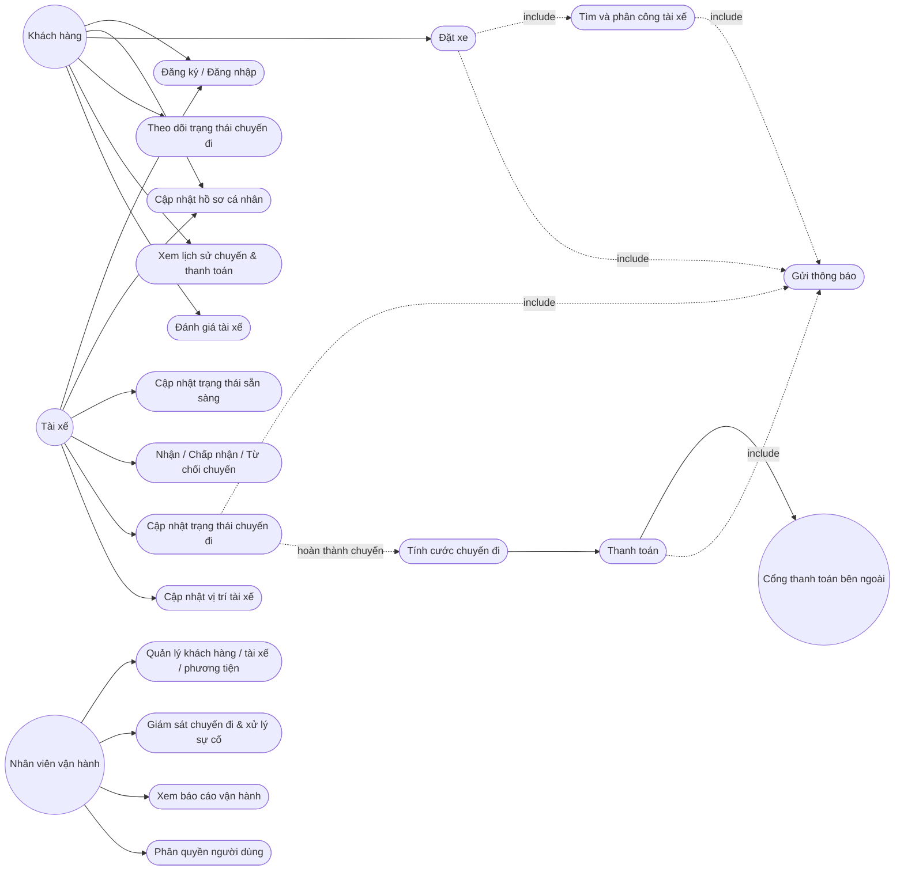
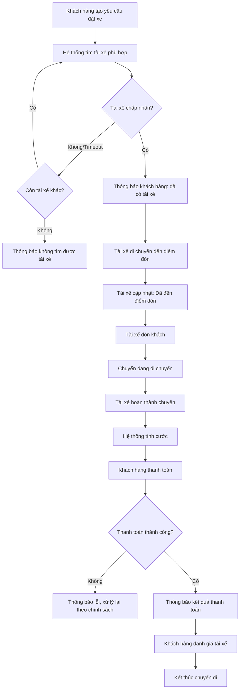

# CAB SYSTEM – NỀN TẢNG ĐẶT XE TRỰC TUYẾN
## Tài liệu phân tích nghiệp vụ (Business Analysis Document)
**Dự án:** Xây dựng CAB System cho Công ty ABC
**Thời gian triển khai:** 7 tuần
**Người thực hiện:** Business Analyst

---

## 1. Vấn đề hiện tại (Problem Statement)

Công ty ABC hiện đang vận hành dịch vụ đặt xe theo mô hình thủ công/bán tự động, tồn tại các vấn đề chính sau:

| # | Vấn đề | Ảnh hưởng |
|---|--------|-----------|
| 1 | Phân công tài xế thực hiện thủ công (qua tổng đài) | Chậm, dễ sai sót, không tối ưu được tài xế gần khách nhất |
| 2 | Khách hàng không theo dõi được trạng thái chuyến đi theo thời gian thực | Trải nghiệm kém, tăng số cuộc gọi hỗ trợ |
| 3 | Thông tin thanh toán không được quản lý tập trung | Khó đối soát doanh thu, khó kiểm soát công nợ |
| 4 | Hệ thống hiện tại khó mở rộng | Không đáp ứng được khi lượng khách/tài xế tăng, khó bổ sung tính năng mới |
| 5 | Không có công cụ báo cáo, giám sát vận hành tập trung | Ban lãnh đạo thiếu dữ liệu ra quyết định |

**Tóm tắt:** Doanh nghiệp cần một nền tảng CAB tự động hóa toàn bộ quy trình đặt xe – phân công tài xế – theo dõi chuyến đi – thanh toán – thông báo – báo cáo, có kiến trúc mở rộng được để phục vụ tăng trưởng dài hạn.

---

## 2. Xác định các bên liên quan (Stakeholders)

### 2.1 Bảng Stakeholder

| Tên / Nhóm | Vai trò trong hệ thống |
|---|---|
| Ban giám đốc Công ty ABC | Phê duyệt phạm vi, ngân sách, định hướng chiến lược sản phẩm |
| Khách hàng (Passenger) | Người dùng đặt xe, theo dõi chuyến, thanh toán, đánh giá tài xế |
| Tài xế (Driver) | Người thực hiện chuyến đi, cập nhật trạng thái, nhận thông báo |
| Nhân viên vận hành (Operator/Admin) | Quản trị khách hàng, tài xế, phương tiện, xử lý sự cố chuyến đi |
| Bộ phận kinh doanh/Marketing | Sử dụng báo cáo doanh thu, chuyến đi để ra quyết định kinh doanh |
| Nhà cung cấp thanh toán bên thứ ba (Payment Gateway) | Xử lý giao dịch thanh toán điện tử, không lưu thông tin nhạy cảm trong CAB |
| Nhóm phát triển (Dev Team/BA/PM) | Phân tích, thiết kế, xây dựng và triển khai hệ thống |
| Bộ phận CSKH (Customer Support) | Hỗ trợ khách hàng/tài xế khi có khiếu nại, sự cố |
| Cơ quan quản lý/tuân thủ (nếu có) | Yêu cầu về bảo mật dữ liệu cá nhân, lưu vết giao dịch |

### 2.2 Stakeholder Matrix (Mermaid – Quadrant: Interest vs Influence)

```mermaid
quadrantChart
    title Stakeholder Matrix - Interest vs Influence
    x-axis Low Interest --> High Interest
    y-axis Low Influence --> High Influence
    quadrant-1 Quản lý chặt chẽ (Manage Closely)
    quadrant-2 Giữ hài lòng (Keep Satisfied)
    quadrant-3 Theo dõi tối thiểu (Monitor)
    quadrant-4 Giữ thông tin (Keep Informed)
    Ban giám đốc: [0.7, 0.9]
    Khách hàng: [0.9, 0.5]
    Tài xế: [0.85, 0.45]
    Nhân viên vận hành: [0.8, 0.6]
    Bộ phận Kinh doanh: [0.6, 0.55]
    Nhà cung cấp thanh toán: [0.4, 0.7]
    Nhóm phát triển: [0.9, 0.65]
    Bộ phận CSKH: [0.55, 0.3]
    Cơ quan quản lý: [0.3, 0.75]
```

---

## 3. Xác định Business Units

| Business Unit | Chức năng chính liên quan đến hệ thống |
|---|---|
| Vận hành (Operations) | Quản lý tài xế, phương tiện, xử lý chuyến đi bất thường, giám sát real-time |
| Chăm sóc khách hàng (Customer Service) | Xử lý khiếu nại, hỗ trợ khách hàng/tài xế |
| Tài chính – Kế toán (Finance) | Tính cước, đối soát thanh toán, doanh thu, công nợ tài xế |
| Kinh doanh (Business Development) | Phân tích số liệu chuyến đi, mở rộng dịch vụ, khuyến mãi |
| Công nghệ thông tin (IT/Engineering) | Phát triển, vận hành, bảo trì hệ thống, đảm bảo khả năng mở rộng |
| Pháp chế/Tuân thủ (Legal & Compliance) | Đảm bảo bảo mật dữ liệu cá nhân, lưu vết thao tác |

---

## 4. Phạm vi dự án trong 7 tuần (Project Scope)

Với thời gian 7 tuần, phạm vi được giới hạn ở mức **MVP (Minimum Viable Product)** – một hệ thống đặt xe trực tuyến cơ bản, đủ để vận hành thực tế, các phần nâng cao được đưa vào backlog cho giai đoạn sau.

### 4.1 Trong phạm vi (In-scope)

- Đăng ký/đăng nhập cho Khách hàng và Tài xế (xác thực cơ bản)
- Khách hàng: cập nhật hồ sơ, tạo yêu cầu đặt xe (điểm đón/đến, loại xe), theo dõi trạng thái chuyến, xem lịch sử chuyến, đánh giá tài xế
- Tài xế: cập nhật hồ sơ/phương tiện, bật/tắt trạng thái sẵn sàng, nhận – chấp nhận/từ chối chuyến, cập nhật trạng thái chuyến
- Tìm tài xế tự động theo vị trí gần nhất + trạng thái sẵn sàng; cơ chế tìm tài xế kế tiếp khi bị từ chối/không phản hồi
- Tính cước cơ bản theo loại dịch vụ + quãng đường/thời gian
- Thanh toán: tiền mặt, và tích hợp đơn giản với 1 cổng thanh toán điện tử (không lưu thông tin thẻ trong hệ thống CAB)
- Thông báo cơ bản (in-app/push) cho các mốc: nhận yêu cầu, tài xế nhận chuyến, tài xế đến điểm đón, hoàn thành chuyến, kết quả thanh toán
- Giao diện quản trị cơ bản: quản lý khách hàng/tài xế/phương tiện/chuyến đi, phân quyền tối thiểu (Admin/Operator)
- Báo cáo cơ bản: số chuyến, tỷ lệ hoàn thành/hủy, doanh thu tổng hợp
- Ghi log các thao tác quan trọng (audit log ở mức cơ bản)

### 4.2 Ngoài phạm vi (Out-of-scope – đưa vào giai đoạn sau)

- Đa dạng phương thức thanh toán, ví điện tử nội bộ
- Tối ưu hóa thuật toán ghép tài xế nâng cao (machine learning)
- Đa kênh thông báo (SMS, email marketing, đa nhà cung cấp)
- Ứng dụng thời gian thực nâng cao (bản đồ chi tiết, dự đoán ETA bằng AI)
- Chatbot CSKH, tích hợp tổng đài
- Chương trình khuyến mãi, mã giảm giá, tích điểm
- Đa ngôn ngữ, đa tiền tệ, mở rộng quốc tế
- Báo cáo/BI nâng cao, dashboard phân tích chuyên sâu

### 4.3 Các nội dung cần làm rõ thêm với khách hàng (Open Items)

- Công thức/chính sách tính cước cụ thể
- Tiêu chí ưu tiên tài xế (ngoài khoảng cách)
- Thời gian tối đa tài xế phải phản hồi một yêu cầu
- Chính sách hủy chuyến (phí hủy, thời điểm cho phép hủy)
- Cách xử lý khi mất kết nối mạng (khách hàng/tài xế)
- Thời gian lưu trữ dữ liệu (lịch sử chuyến, vị trí, giao dịch)

---

## 5. Yêu cầu nghiệp vụ (Business Requirements – BR)

| Mã | Yêu cầu nghiệp vụ | Mô tả |
|---|---|---|
| BR-01 | Quản lý tài khoản người dùng | Hệ thống phải cho phép Khách hàng và Tài xế đăng ký, đăng nhập, quản lý hồ sơ cá nhân |
| BR-02 | Đặt xe trực tuyến | Hệ thống phải cho phép Khách hàng tạo yêu cầu đặt xe với điểm đón, điểm đến, loại xe |
| BR-03 | Tự động phân công tài xế | Hệ thống phải tự động tìm và đề xuất tài xế phù hợp, xử lý được trường hợp tài xế từ chối/không phản hồi |
| BR-04 | Theo dõi chuyến đi thời gian thực | Hệ thống phải cho khách hàng biết trạng thái chuyến đi và tài xế theo thời gian thực |
| BR-05 | Tính cước và thanh toán | Hệ thống phải tính cước tự động sau khi hoàn thành chuyến và hỗ trợ thanh toán tiền mặt/điện tử |
| BR-06 | Bảo mật dữ liệu thanh toán | Hệ thống không lưu trực tiếp thông tin nhạy cảm thanh toán, phải qua nhà cung cấp thanh toán bên ngoài |
| BR-07 | Thông báo đa mốc sự kiện | Hệ thống phải thông báo cho khách hàng/tài xế tại các mốc quan trọng của chuyến đi |
| BR-08 | Quản trị vận hành | Hệ thống phải cung cấp công cụ cho nhân viên vận hành quản lý khách hàng, tài xế, phương tiện, chuyến đi |
| BR-09 | Phân quyền truy cập | Hệ thống phải phân quyền để giới hạn thao tác nhạy cảm chỉ dành cho vai trò phù hợp |
| BR-10 | Báo cáo vận hành & kinh doanh | Hệ thống phải cung cấp báo cáo về số chuyến, doanh thu, tỷ lệ hoàn thành/hủy, hiệu quả tài xế |
| BR-11 | Khả năng mở rộng hệ thống | Kiến trúc hệ thống phải cho phép mở rộng độc lập từng thành phần và bổ sung tính năng mà không ảnh hưởng toàn hệ thống |
| BR-12 | Bảo mật & lưu vết | Hệ thống phải xác thực người dùng, kiểm soát truy cập và ghi log các thao tác quan trọng |

---

## 6. Phân rã yêu cầu chức năng (Functional Requirements Decomposition)

### 6.1 Nhóm: Quản lý tài khoản (từ BR-01)
- FR-01.1: Đăng ký tài khoản Khách hàng
- FR-01.2: Đăng ký/khởi tạo tài khoản Tài xế (tự đăng ký hoặc do Operator tạo)
- FR-01.3: Đăng nhập/Đăng xuất
- FR-01.4: Cập nhật thông tin cá nhân (Khách hàng)
- FR-01.5: Cập nhật hồ sơ và thông tin phương tiện (Tài xế)
- FR-01.6: Cập nhật trạng thái hoạt động của Tài xế (sẵn sàng/ngoại tuyến)

### 6.2 Nhóm: Đặt xe (từ BR-02)
- FR-02.1: Nhập điểm đón và điểm đến
- FR-02.2: Chọn loại xe/dịch vụ
- FR-02.3: Gửi yêu cầu đặt xe
- FR-02.4: Hủy yêu cầu đặt xe (trước khi tài xế nhận/đang tìm)

### 6.3 Nhóm: Tìm & phân công tài xế (từ BR-03)
- FR-03.1: Xác định vị trí khách hàng
- FR-03.2: Xác định danh sách tài xế sẵn sàng
- FR-03.3: Lọc/xếp hạng tài xế theo khoảng cách và tiêu chí vận hành
- FR-03.4: Gửi đề xuất chuyến đến tài xế phù hợp nhất
- FR-03.5: Xử lý khi tài xế từ chối/không phản hồi → tìm tài xế kế tiếp
- FR-03.6: Thông báo cho khách hàng khi không tìm được tài xế

### 6.4 Nhóm: Theo dõi chuyến đi (từ BR-04)
- FR-04.1: Cập nhật trạng thái chuyến đi (đã đến điểm đón, đã đón khách, đang di chuyển, hoàn thành)
- FR-04.2: Cập nhật vị trí tài xế theo thời gian thực
- FR-04.3: Hiển thị trạng thái chuyến đi cho khách hàng
- FR-04.4: Ước tính thời gian tài xế đến điểm đón (ETA)

### 6.5 Nhóm: Tính cước & thanh toán (từ BR-05, BR-06)
- FR-05.1: Tính cước dựa trên loại dịch vụ và thông tin chuyến đi
- FR-05.2: Thanh toán bằng tiền mặt
- FR-05.3: Thanh toán điện tử qua cổng thanh toán bên thứ ba
- FR-05.4: Xử lý khi giao dịch thanh toán điện tử thất bại
- FR-05.5: Xem lịch sử chuyến đi và số tiền đã thanh toán

### 6.6 Nhóm: Thông báo (từ BR-07)
- FR-06.1: Thông báo khi yêu cầu đặt xe được tiếp nhận
- FR-06.2: Thông báo khi tài xế nhận chuyến
- FR-06.3: Thông báo khi tài xế đến điểm đón
- FR-06.4: Thông báo khi chuyến hoàn thành
- FR-06.5: Thông báo kết quả thanh toán
- FR-06.6: Thông báo cho tài xế về chuyến mới/thay đổi chuyến

### 6.7 Nhóm: Quản trị vận hành (từ BR-08, BR-09)
- FR-07.1: Quản lý danh sách khách hàng
- FR-07.2: Quản lý danh sách tài xế và phương tiện
- FR-07.3: Xem danh sách chuyến đang diễn ra
- FR-07.4: Xử lý chuyến gặp sự cố
- FR-07.5: Tra cứu lịch sử giao dịch
- FR-07.6: Phân quyền chức năng theo vai trò nhân viên

### 6.8 Nhóm: Báo cáo (từ BR-10)
- FR-08.1: Báo cáo số lượng chuyến theo thời gian
- FR-08.2: Báo cáo doanh thu
- FR-08.3: Báo cáo tỷ lệ hoàn thành/hủy chuyến
- FR-08.4: Báo cáo hiệu quả hoạt động tài xế

### 6.9 Nhóm: Đánh giá (bổ sung từ mô tả)
- FR-09.1: Khách hàng đánh giá tài xế sau khi hoàn thành chuyến

---

## 7. Use Case Diagram



---

## 8. Đặc tả Use Case (Use Case Specification)

### UC-03: Đặt xe (Book a Ride)

| Mục | Nội dung |
|---|---|
| **Mã use case** | UC-03 |
| **Tên** | Đặt xe |
| **Tác nhân chính** | Khách hàng |
| **Tác nhân phụ** | Hệ thống tìm tài xế |
| **Mô tả** | Khách hàng tạo yêu cầu đặt xe bằng cách nhập điểm đón, điểm đến và chọn loại xe |
| **Điều kiện tiên quyết** | Khách hàng đã đăng nhập; tài khoản ở trạng thái hoạt động |
| **Điều kiện kết thúc (thành công)** | Yêu cầu đặt xe được tạo và chuyển sang trạng thái "Đang tìm tài xế" |
| **Luồng chính** | 1. Khách hàng nhập điểm đón, điểm đến<br>2. Khách hàng chọn loại xe<br>3. Hệ thống hiển thị cước phí ước tính<br>4. Khách hàng xác nhận gửi yêu cầu<br>5. Hệ thống ghi nhận yêu cầu, chuyển trạng thái "Đang tìm tài xế"<br>6. Hệ thống gửi thông báo xác nhận cho khách hàng<br>7. Hệ thống kích hoạt use case "Tìm và phân công tài xế" |
| **Luồng thay thế** | 3a. Khách hàng hủy yêu cầu trước khi có tài xế nhận → yêu cầu chuyển trạng thái "Đã hủy" |
| **Ngoại lệ** | - Điểm đón/đến không hợp lệ → hệ thống báo lỗi, yêu cầu nhập lại<br>- Không có loại xe phù hợp tại khu vực → thông báo cho khách hàng |
| **Yêu cầu đặc biệt** | Thời gian phản hồi hiển thị cước ước tính < 3 giây |

### UC-11: Tìm và phân công tài xế (Driver Matching)

| Mục | Nội dung |
|---|---|
| **Mã use case** | UC-11 |
| **Tên** | Tìm và phân công tài xế |
| **Tác nhân chính** | Hệ thống (tự động) |
| **Tác nhân phụ** | Tài xế |
| **Mô tả** | Hệ thống xác định và đề xuất tài xế phù hợp cho một yêu cầu đặt xe |
| **Điều kiện tiên quyết** | Có yêu cầu đặt xe ở trạng thái "Đang tìm tài xế" |
| **Điều kiện kết thúc (thành công)** | Một tài xế chấp nhận chuyến, chuyến chuyển trạng thái "Đã có tài xế" |
| **Luồng chính** | 1. Hệ thống xác định vị trí khách hàng<br>2. Hệ thống lọc danh sách tài xế đang ở trạng thái sẵn sàng, gần khách hàng<br>3. Hệ thống xếp hạng tài xế theo khoảng cách và tiêu chí vận hành<br>4. Hệ thống gửi đề xuất chuyến cho tài xế xếp hạng cao nhất<br>5. Tài xế chấp nhận chuyến trong thời gian quy định<br>6. Hệ thống cập nhật trạng thái chuyến "Đã có tài xế" và thông báo cho khách hàng |
| **Luồng thay thế** | 5a. Tài xế từ chối hoặc không phản hồi trong thời gian quy định → hệ thống loại tài xế này khỏi danh sách đề xuất cho chuyến hiện tại, quay lại bước 4 với tài xế kế tiếp |
| **Ngoại lệ** | Không còn tài xế phù hợp sau khi duyệt hết danh sách → hệ thống chuyển chuyến sang trạng thái "Không tìm được tài xế" và thông báo cho khách hàng |
| **Yêu cầu đặc biệt** | Thời gian chờ phản hồi tối đa của mỗi tài xế: *cần xác nhận với khách hàng (Open Item)* |

### UC-09: Cập nhật trạng thái chuyến đi (Update Trip Status)

| Mục | Nội dung |
|---|---|
| **Mã use case** | UC-09 |
| **Tên** | Cập nhật trạng thái chuyến đi |
| **Tác nhân chính** | Tài xế |
| **Mô tả** | Tài xế cập nhật các mốc trạng thái trong quá trình thực hiện chuyến |
| **Điều kiện tiên quyết** | Tài xế đã chấp nhận chuyến |
| **Điều kiện kết thúc (thành công)** | Trạng thái chuyến được cập nhật và đồng bộ đến khách hàng |
| **Luồng chính** | 1. Tài xế chọn cập nhật trạng thái: Đã đến điểm đón → Đã đón khách → Đang di chuyển → Hoàn thành chuyến<br>2. Hệ thống ghi nhận từng mốc thời gian<br>3. Hệ thống gửi thông báo tương ứng cho khách hàng<br>4. Khi trạng thái "Hoàn thành chuyến" được ghi nhận, hệ thống kích hoạt use case "Tính cước chuyến đi" |
| **Ngoại lệ** | Tài xế cập nhật sai thứ tự trạng thái → hệ thống từ chối và giữ nguyên trạng thái hiện tại |

### UC-13: Thanh toán (Process Payment)

| Mục | Nội dung |
|---|---|
| **Mã use case** | UC-13 |
| **Tên** | Thanh toán |
| **Tác nhân chính** | Khách hàng |
| **Tác nhân phụ** | Cổng thanh toán bên ngoài |
| **Mô tả** | Xử lý thanh toán cước phí sau khi chuyến đi hoàn thành |
| **Điều kiện tiên quyết** | Chuyến đi ở trạng thái "Hoàn thành", cước phí đã được tính |
| **Điều kiện kết thúc (thành công)** | Giao dịch thanh toán thành công, chuyến chuyển trạng thái "Đã thanh toán" |
| **Luồng chính** | 1. Hệ thống hiển thị số tiền cần thanh toán<br>2. Khách hàng chọn phương thức: tiền mặt hoặc điện tử<br>3a. Nếu tiền mặt: hệ thống ghi nhận thanh toán khi tài xế xác nhận đã nhận tiền<br>3b. Nếu điện tử: hệ thống gửi yêu cầu giao dịch đến cổng thanh toán bên ngoài<br>4. Cổng thanh toán trả về kết quả giao dịch<br>5. Hệ thống cập nhật trạng thái thanh toán và gửi thông báo kết quả |
| **Ngoại lệ** | Giao dịch điện tử thất bại → hệ thống thông báo cho khách hàng và cho phép thử lại/đổi phương thức theo chính sách doanh nghiệp *(Open Item)* |
| **Yêu cầu đặc biệt** | Thông tin thẻ/tài khoản thanh toán không được lưu trong hệ thống CAB |

---

## 9. Phân tích quy trình nghiệp vụ (Business Process Analysis)

### 9.1 Quy trình tổng thể: Từ đặt xe đến đánh giá



### 9.2 Các bước xử lý chính theo Business Unit

| Giai đoạn | Business Unit chịu trách nhiệm | Hệ thống hỗ trợ |
|---|---|---|
| Tiếp nhận yêu cầu đặt xe | Vận hành | Module đặt xe |
| Phân công tài xế | Vận hành (tự động) | Module matching |
| Thực hiện chuyến đi | Tài xế / Vận hành giám sát | Module theo dõi chuyến |
| Tính cước & thanh toán | Tài chính | Module thanh toán + Cổng thanh toán ngoài |
| Xử lý sự cố chuyến đi | Vận hành / CSKH | Giao diện quản trị |
| Báo cáo doanh thu, hiệu quả | Kinh doanh / Ban giám đốc | Module báo cáo |

---

## 10. Phân tích quy tắc nghiệp vụ (Business Rules)

| Mã | Quy tắc nghiệp vụ | Ghi chú |
|---|---|---|
| BRule-01 | Khách hàng và tài xế phải xác thực (đăng nhập) trước khi sử dụng các chức năng yêu cầu tài khoản | Bắt buộc |
| BRule-02 | Chỉ tài xế ở trạng thái "sẵn sàng" mới được đề xuất nhận chuyến mới | Bắt buộc |
| BRule-03 | Nếu tài xế được đề xuất từ chối hoặc không phản hồi trong thời gian quy định, hệ thống phải tự động chuyển sang tài xế kế tiếp mà không yêu cầu khách hàng tạo lại yêu cầu | Thời gian phản hồi cụ thể: **cần xác nhận (Open Item)** |
| BRule-04 | Nếu không tìm được tài xế phù hợp, khách hàng phải được thông báo rõ ràng | Bắt buộc |
| BRule-05 | Cước phí chuyến đi chỉ được tính sau khi chuyến đi chuyển trạng thái "Hoàn thành" | Bắt buộc |
| BRule-06 | Công thức tính cước phụ thuộc loại dịch vụ và thông tin chuyến đi | Công thức cụ thể: **cần xác nhận (Open Item)** |
| BRule-07 | Thông tin nhạy cảm của thẻ/tài khoản thanh toán không được lưu trực tiếp trong hệ thống CAB | Bắt buộc – yêu cầu bảo mật |
| BRule-08 | Nếu giao dịch thanh toán điện tử thất bại, hệ thống phải thông báo cho khách hàng và cho phép xử lý lại | Chính sách xử lý lại cụ thể: **cần xác nhận (Open Item)** |
| BRule-09 | Một số chức năng quản trị nhạy cảm chỉ được thực hiện bởi vai trò được phân quyền phù hợp (không dành cho nhân viên vận hành thông thường) | Bắt buộc |
| BRule-10 | Mọi thao tác quan trọng trên hệ thống (thay đổi trạng thái chuyến, giao dịch thanh toán, thao tác quản trị nhạy cảm) phải được ghi log để phục vụ kiểm tra | Bắt buộc |
| BRule-11 | Một lỗi ở chức năng thanh toán hoặc thông báo không được làm ngừng hoạt động toàn bộ hệ thống đặt xe | Yêu cầu kiến trúc – các thành phần hoạt động độc lập |
| BRule-12 | Chính sách hủy chuyến (phí hủy, thời điểm được phép hủy) | **Cần xác nhận (Open Item)** |
| BRule-13 | Cách xử lý khi khách hàng/tài xế mất kết nối mạng trong khi thực hiện chuyến | **Cần xác nhận (Open Item)** |
| BRule-14 | Thời gian lưu trữ dữ liệu chuyến đi, vị trí, giao dịch | **Cần xác nhận (Open Item)** |

---

## Ghi chú tổng hợp các vấn đề cần làm rõ với khách hàng (Open Items tổng hợp)

1. Công thức/chính sách tính cước cụ thể
2. Tiêu chí ưu tiên tài xế ngoài yếu tố khoảng cách
3. Thời gian tối đa tài xế phải phản hồi một đề xuất chuyến
4. Chính sách hủy chuyến (phí, thời điểm)
5. Cách xử lý khi mất kết nối mạng
6. Thời gian lưu trữ dữ liệu (chuyến đi, vị trí, giao dịch)
7. Chính sách xử lý lại khi giao dịch thanh toán điện tử thất bại
