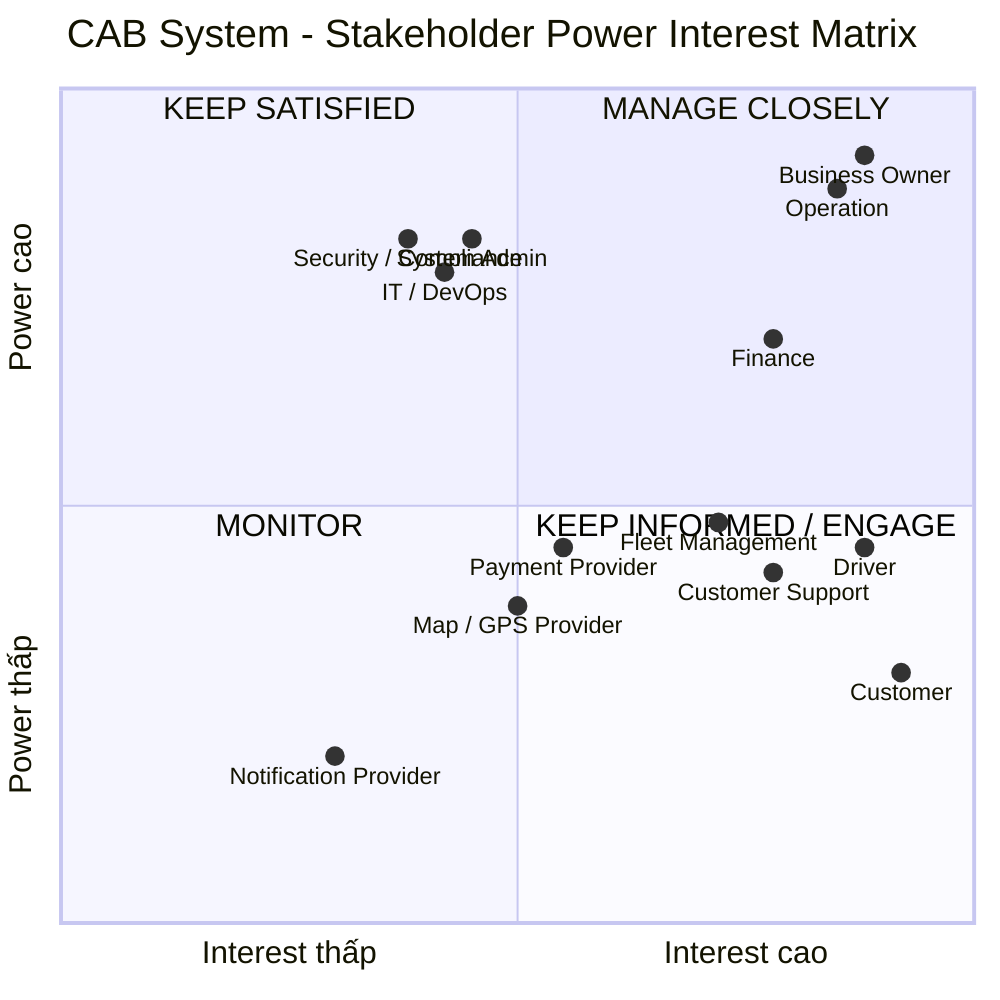
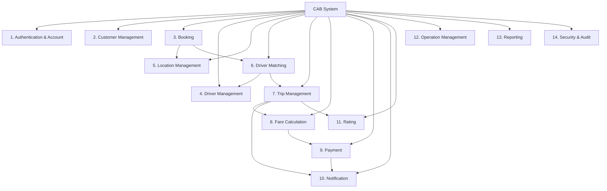

# 23631191_TranQuocKhanh_CABsystem

# CAB System

# Vấn đề hiện tại là gì
Hiện tại, hệ thống đặt xe của công ty ABC còn tồn tại nhiều hạn chế trong quá trình vận hành. Việc phân công tài xế chủ yếu được thực hiện thủ công, dẫn đến mất nhiều thời gian, dễ xảy ra sai sót và khó đáp ứng khi số lượng khách hàng và tài xế tăng cao. Khách hàng cũng chưa có khả năng theo dõi đầy đủ trạng thái chuyến đi, chẳng hạn như hệ thống đang tìm tài xế, tài xế nào đã nhận chuyến hoặc thời gian dự kiến tài xế đến. Bên cạnh đó, thông tin thanh toán chưa được quản lý tập trung, gây khó khăn trong việc tra cứu, đối soát và xử lý các giao dịch thất bại.

Về phía vận hành, nhân viên gặp khó khăn trong việc theo dõi các chuyến đang diễn ra, quản lý trạng thái tài xế và xử lý các trường hợp chuyến bị lỗi. Hệ thống hiện tại cũng chưa có cơ chế tự động và tối ưu để tìm tài xế phù hợp khi tài xế từ chối hoặc không phản hồi. Ngoài ra, khả năng mở rộng hệ thống còn hạn chế, có nguy cơ ảnh hưởng đến toàn bộ hoạt động khi một thành phần như thanh toán hoặc thông báo gặp sự cố. Doanh nghiệp cũng chưa có đầy đủ cơ chế phân quyền, lưu vết thao tác và báo cáo để phục vụ quản lý và kiểm soát hoạt động.

Bên cạnh các vấn đề trên, một số quy tắc nghiệp vụ quan trọng như cách tính cước, tiêu chí lựa chọn tài xế, thời gian phản hồi, chính sách hủy chuyến, xử lý mất kết nối và thời gian lưu trữ dữ liệu vẫn chưa được thống nhất. Điều này có thể gây khó khăn cho quá trình phát triển và làm phát sinh thay đổi yêu cầu trong quá trình triển khai. Vì vậy, doanh nghiệp cần xây dựng một nền tảng CAB mới có khả năng tự động hóa quy trình đặt và phân công xe, minh bạch trạng thái chuyến, quản lý thanh toán tập trung, hỗ trợ vận hành hiệu quả và có kiến trúc linh hoạt để mở rộng trong tương lai.

## Stakeholder

| Tên Stakeholder | Vai trò trong hệ thống |
|---|---|
| Khách hàng (Customer) | Đăng ký, đăng nhập, đặt xe, theo dõi chuyến đi, thanh toán, xem lịch sử và đánh giá tài xế. |
| Tài xế (Driver) | Quản lý hồ sơ và phương tiện, cập nhật trạng thái hoạt động, nhận/từ chối chuyến, cập nhật trạng thái và vị trí chuyến đi. |
| Nhân viên vận hành (Operation Staff) | Theo dõi các chuyến đang diễn ra, quản lý trạng thái tài xế và xử lý các trường hợp chuyến bị lỗi hoặc bất thường. |
| Quản trị viên (System Admin) | Quản lý tài khoản, người dùng, phân quyền và các cấu hình quản trị của hệ thống. |
| Ban lãnh đạo (Business Owner/Management) | Theo dõi báo cáo, doanh thu, số lượng chuyến và hiệu quả hoạt động để đưa ra quyết định kinh doanh. |
| Bộ phận chăm sóc khách hàng (Customer Support) | Tiếp nhận và xử lý các yêu cầu, khiếu nại liên quan đến khách hàng, chuyến đi và thanh toán. |
| Bộ phận Tài chính/Kế toán | Theo dõi giao dịch, doanh thu và thực hiện đối soát các khoản thanh toán. |
| Bộ phận quản lý đội xe (Fleet Management) | Quản lý thông tin tài xế, phương tiện và tình trạng hoạt động của đội xe. |
| Bộ phận IT/DevOps | Phát triển, triển khai, giám sát, bảo trì và đảm bảo hệ thống hoạt động ổn định. |
| Bộ phận An toàn thông tin (Security/Compliance) | Kiểm soát bảo mật, phân quyền, bảo vệ dữ liệu và theo dõi các hoạt động quan trọng của hệ thống. |
| Nhà cung cấp thanh toán (Payment Provider) | Xử lý các giao dịch thanh toán điện tử và trả kết quả giao dịch cho hệ thống CAB. |
| Nhà cung cấp bản đồ/định vị (Map/GPS Provider) | Cung cấp dữ liệu vị trí, khoảng cách, tuyến đường và hỗ trợ tính thời gian dự kiến đến (ETA). |
| Nhà cung cấp thông báo (Notification Provider) | Gửi thông báo đến khách hàng và tài xế thông qua Push Notification, SMS, Email hoặc các kênh khác. |

## Stakeholder Matrix

Stakeholder Matrix được sử dụng để đánh giá các bên liên quan dựa trên hai tiêu chí chính: **Power (mức độ ảnh hưởng/quyền quyết định)** và **Interest (mức độ quan tâm đến dự án)**. Từ đó xác định chiến lược làm việc phù hợp với từng nhóm stakeholder.

| Stakeholder | Power | Interest | Chiến lược quản lý |
|---|---|---|---|
| Business Owner / Ban lãnh đạo | Cao | Cao | Manage Closely – Tham gia các quyết định quan trọng, phê duyệt phạm vi, mục tiêu, business rules và KPI. |
| Operation Manager / Nhân viên vận hành | Cao | Cao | Manage Closely – Tham gia phân tích quy trình vận hành, điều phối tài xế và xử lý các trường hợp ngoại lệ. |
| Finance / Accounting | Trung bình | Cao | Manage Closely – Xác định yêu cầu về thanh toán, doanh thu, giao dịch và đối soát. |
| Customer | Thấp | Cao | Keep Informed / Engage – Thu thập nhu cầu và phản hồi để đảm bảo trải nghiệm đặt xe tốt. |
| Driver | Trung bình | Cao | Keep Informed / Engage – Tham gia xác định quy trình nhận chuyến, matching, cập nhật trạng thái và vị trí. |
| Customer Support | Trung bình | Cao | Keep Informed / Engage – Xác định nhu cầu tra cứu và xử lý khiếu nại, hỗ trợ khách hàng. |
| Fleet Management | Trung bình | Cao | Keep Informed / Engage – Xác định yêu cầu quản lý tài xế, phương tiện và tình trạng hoạt động. |
| System Admin | Cao | Trung bình | Keep Satisfied – Đảm bảo yêu cầu quản trị, phân quyền và cấu hình hệ thống. |
| IT / DevOps | Cao | Trung bình | Keep Satisfied – Tham gia các vấn đề về kiến trúc, hiệu năng, triển khai, monitoring và vận hành. |
| Security / Compliance | Cao | Trung bình | Keep Satisfied – Kiểm soát authentication, authorization, bảo vệ dữ liệu và audit log. |
| Payment Provider | Trung bình | Trung bình | Keep Satisfied – Đảm bảo tích hợp thanh toán, xử lý giao dịch và nhận kết quả thanh toán ổn định. |
| Map / GPS Provider | Trung bình | Trung bình | Keep Satisfied – Cung cấp dữ liệu vị trí, khoảng cách, tuyến đường và ETA. |
| Notification Provider | Thấp | Trung bình | Monitor – Theo dõi khả năng gửi notification và xử lý retry khi có lỗi. |

## Ma trận các bên liên quan

## Ma trận các bên liên quan

Ma trận các bên liên quan được phân loại dựa trên hai tiêu chí:

- **Power:** Mức độ quyền lực/ảnh hưởng của stakeholder đối với dự án.
- **Interest:** Mức độ quan tâm của stakeholder đối với hệ thống CAB.



### Chiến lược quản lý

| Nhóm | Chiến lược |
|---|---|
| **Manage Closely** | Làm việc thường xuyên, tham gia phân tích, review và phê duyệt các yêu cầu quan trọng. |
| **Keep Satisfied** | Đảm bảo stakeholder được cung cấp đầy đủ thông tin và được tham gia khi có vấn đề liên quan. |
| **Keep Informed / Engage** | Thường xuyên thu thập nhu cầu, phản hồi và cập nhật thông tin liên quan đến hệ thống. |
| **Monitor** | Theo dõi ở mức phù hợp và trao đổi khi có thay đổi ảnh hưởng đến stakeholder. |   

## Xác định Business Unit

Business Unit là các đơn vị/bộ phận trong doanh nghiệp tham gia vào quá trình cung cấp, vận hành, quản lý và hỗ trợ dịch vụ CAB.

| Business Unit | Vai trò trong hệ thống |
|---|---|
| **Ban lãnh đạo (Management)** | Xác định mục tiêu kinh doanh, định hướng phát triển sản phẩm, phê duyệt chính sách và theo dõi các chỉ số kinh doanh như doanh thu, số lượng chuyến, tỷ lệ hoàn thành và tỷ lệ hủy. |
| **Bộ phận Vận hành (Operations)** | Điều phối và giám sát hoạt động đặt xe, theo dõi chuyến đang diễn ra, quản lý trạng thái tài xế và xử lý các trường hợp bất thường trong quá trình vận hành. |
| **Bộ phận Quản lý tài xế/Đội xe (Fleet Management)** | Quản lý hồ sơ tài xế, phương tiện, trạng thái hoạt động và hiệu quả làm việc của tài xế. |
| **Bộ phận Chăm sóc khách hàng (Customer Service)** | Tiếp nhận và xử lý yêu cầu hỗ trợ, khiếu nại của khách hàng liên quan đến tài khoản, chuyến đi, tài xế và thanh toán. |
| **Bộ phận Tài chính/Kế toán (Finance & Accounting)** | Quản lý doanh thu, giao dịch thanh toán, đối soát với các nhà cung cấp thanh toán và hỗ trợ xử lý các vấn đề liên quan đến giao dịch. |
| **Bộ phận Công nghệ thông tin (IT)** | Phát triển, duy trì và đảm bảo hệ thống CAB hoạt động ổn định, an toàn và có khả năng mở rộng. |
| **Bộ phận DevOps/Infrastructure** | Quản lý môi trường triển khai, monitoring, logging, deployment và khả năng mở rộng hạ tầng hệ thống. |
| **Bộ phận An toàn thông tin (Security/Compliance)** | Đảm bảo hệ thống tuân thủ các yêu cầu về xác thực, phân quyền, bảo vệ dữ liệu cá nhân, dữ liệu vị trí, dữ liệu giao dịch và audit log. |
| **Khách hàng (Customer)** | Sử dụng dịch vụ CAB để đặt xe, theo dõi chuyến, thanh toán và đánh giá chất lượng dịch vụ. |
| **Tài xế (Driver)** | Cung cấp dịch vụ vận chuyển, nhận chuyến, thực hiện chuyến, cập nhật trạng thái và vị trí trong quá trình phục vụ khách hàng. |

## Phạm vi dự án trong 7 tuần

### 1. Mục tiêu phạm vi

Trong thời gian triển khai 7 tuần, dự án tập trung xây dựng **MVP (Minimum Viable Product)** của CAB System, đáp ứng đầy đủ quy trình đặt xe trực tuyến cơ bản từ khi khách hàng tạo yêu cầu đến khi chuyến xe hoàn thành và thanh toán.

Mục tiêu của MVP là tạo ra một hệ thống có thể vận hành được quy trình:

**Customer → Booking → Driver Matching → Driver Acceptance → Trip → Fare → Payment → Completion**

Các tính năng nâng cao và các yêu cầu chưa có business rule rõ ràng sẽ được xem xét cho các giai đoạn phát triển tiếp theo.

---

### 2. Phạm vi chức năng chính

| Nhóm chức năng | Phạm vi thực hiện trong MVP | Mức độ |
|---|---|---|
| **Authentication** | Đăng ký, đăng nhập, đăng xuất cho Customer và Driver | Must Have |
| **Customer Profile** | Xem và cập nhật thông tin cá nhân | Must Have |
| **Driver Profile** | Xem và cập nhật thông tin tài xế | Must Have |
| **Vehicle Management** | Quản lý thông tin phương tiện của tài xế | Must Have |
| **Driver Availability** | Driver bật/tắt trạng thái sẵn sàng nhận chuyến | Must Have |
| **Booking** | Customer nhập điểm đón, điểm đến và chọn loại xe | Must Have |
| **Driver Matching** | Hệ thống tìm tài xế phù hợp dựa trên trạng thái và khoảng cách cơ bản | Must Have |
| **Driver Acceptance** | Driver nhận thông báo và Accept/Reject chuyến | Must Have |
| **Trip Management** | Quản lý trạng thái chuyến từ nhận chuyến đến hoàn thành | Must Have |
| **Driver Location** | Cập nhật vị trí tài xế ở mức cơ bản để hỗ trợ theo dõi chuyến | Should Have |
| **Fare Calculation** | Tính cước dựa trên loại xe và thông tin chuyến đi theo công thức cơ bản | Must Have |
| **Payment** | Thanh toán tiền mặt và tích hợp một phương thức thanh toán điện tử | Must Have |
| **Payment Status** | Theo dõi trạng thái thanh toán Success/Failed/Pending | Must Have |
| **Notification** | Thông báo các sự kiện chính của booking/trip/payment | Must Have |
| **Trip History** | Customer và Driver xem lịch sử chuyến | Should Have |
| **Rating** | Customer đánh giá Driver sau khi hoàn thành chuyến | Should Have |
| **Operation Dashboard** | Nhân viên vận hành xem danh sách và trạng thái các chuyến | Must Have |
| **Driver Management** | Operation quản lý danh sách tài xế | Must Have |
| **Customer Management** | Operation xem và quản lý khách hàng | Should Have |
| **Basic Reporting** | Báo cáo cơ bản về số chuyến, doanh thu, hoàn thành và hủy | Should Have |
| **RBAC** | Phân quyền cơ bản giữa Customer, Driver, Operation và Admin | Must Have |
| **Audit Log** | Lưu vết một số thao tác quản trị quan trọng | Should Have |

## Xác định phạm vi dự án trong 7 tuần

### 1. Mục tiêu phạm vi

Trong thời gian 7 tuần, dự án tập trung xây dựng **MVP (Minimum Viable Product)** của CAB System, với mục tiêu cung cấp một hệ thống đặt xe trực tuyến cơ bản nhưng có đầy đủ quy trình nghiệp vụ cốt lõi.

Phạm vi MVP phải đảm bảo khách hàng có thể thực hiện một chuyến xe hoàn chỉnh theo quy trình:

**Đăng nhập → Đặt xe → Tìm tài xế → Tài xế nhận chuyến → Thực hiện chuyến → Hoàn thành → Tính cước → Thanh toán**

Đồng thời, tài xế và nhân viên vận hành phải có các chức năng tối thiểu để tham gia và quản lý quy trình trên.

---

### 2. Phạm vi trong dự án (In Scope)

| Nhóm chức năng | Phạm vi |
|---|---|
| **Quản lý tài khoản** | Đăng ký, đăng nhập, đăng xuất và cập nhật thông tin cá nhân cho Customer/Driver. |
| **Quản lý tài xế** | Quản lý hồ sơ tài xế, trạng thái sẵn sàng nhận chuyến và thông tin phương tiện. |
| **Quản lý phương tiện** | Lưu trữ và quản lý thông tin cơ bản của phương tiện. |
| **Đặt xe** | Customer nhập điểm đón, điểm đến và lựa chọn loại xe để tạo yêu cầu đặt xe. |
| **Tìm tài xế** | Hệ thống tìm tài xế phù hợp dựa trên trạng thái sẵn sàng, loại xe và khoảng cách đến điểm đón. |
| **Phân công tài xế** | Gửi yêu cầu đến tài xế; nếu tài xế từ chối hoặc không phản hồi thì tìm tài xế tiếp theo. |
| **Quản lý chuyến đi** | Theo dõi và cập nhật trạng thái từ khi tạo booking đến khi hoàn thành chuyến. |
| **Theo dõi vị trí** | Cập nhật vị trí tài xế ở mức cơ bản để hỗ trợ theo dõi chuyến. |
| **Tính cước** | Tính số tiền khách hàng phải trả dựa trên loại xe và thông tin chuyến theo công thức cước cơ bản. |
| **Thanh toán** | Hỗ trợ thanh toán tiền mặt và một phương thức thanh toán điện tử. |
| **Thông báo** | Gửi thông báo cho Customer/Driver về các sự kiện quan trọng của booking và trip. |
| **Lịch sử chuyến** | Customer và Driver có thể xem các chuyến đã thực hiện. |
| **Đánh giá** | Customer có thể đánh giá Driver sau khi hoàn thành chuyến. |
| **Quản lý vận hành** | Operation có thể xem Customer, Driver, Trip và trạng thái chuyến đang diễn ra. |
| **Phân quyền** | Phân quyền cơ bản cho Customer, Driver, Operation và Admin. |
| **Audit Log** | Lưu vết các thao tác quản trị quan trọng. |

---

### 3. Quy trình nghiệp vụ cốt lõi

MVP phải hoàn thành được quy trình end-to-end sau:

```text
Customer Login
      ↓
Nhập điểm đón / điểm đến
      ↓
Chọn loại xe
      ↓
Tạo Booking
      ↓
Hệ thống tìm Driver
      ↓
Driver nhận chuyến
      ↓
Driver đến điểm đón
      ↓
Đón khách
      ↓
Thực hiện chuyến
      ↓
Hoàn thành chuyến
      ↓
Tính cước
      ↓
Thanh toán
      ↓
Customer đánh giá Driver
```

## Business Requirements

### 1. Mục tiêu

Business Requirements mô tả các nhu cầu và mục tiêu ở cấp độ nghiệp vụ mà CAB System cần đáp ứng. Các yêu cầu dưới đây được xây dựng dựa trên mục tiêu của doanh nghiệp và phạm vi MVP trong 7 tuần.

---

### 2. Danh sách Business Requirements

| ID | Business Requirement | Priority |
|---|---|---|
| **BR-01** | Doanh nghiệp cần cung cấp một nền tảng đặt xe trực tuyến cho phép khách hàng tạo và quản lý yêu cầu đặt xe mà không cần phụ thuộc vào tổng đài hoặc thao tác thủ công. | Must Have |
| **BR-02** | Doanh nghiệp cần quản lý tập trung thông tin khách hàng, tài xế và phương tiện để hỗ trợ hoạt động vận hành dịch vụ. | Must Have |
| **BR-03** | Doanh nghiệp cần tự động hóa quá trình tìm kiếm và phân công tài xế phù hợp cho các yêu cầu đặt xe. | Must Have |
| **BR-04** | Doanh nghiệp cần đảm bảo khi tài xế từ chối hoặc không phản hồi, hệ thống có thể tiếp tục tìm tài xế khác mà không yêu cầu khách hàng tạo lại yêu cầu. | Must Have |
| **BR-05** | Doanh nghiệp cần cung cấp khả năng theo dõi vòng đời chuyến đi từ khi khách hàng tạo yêu cầu đến khi chuyến được hoàn thành. | Must Have |
| **BR-06** | Doanh nghiệp cần cung cấp thông tin về tài xế và trạng thái chuyến để khách hàng có thể chủ động theo dõi quá trình sử dụng dịch vụ. | Must Have |
| **BR-07** | Doanh nghiệp cần sử dụng thông tin vị trí tài xế để hỗ trợ việc lựa chọn tài xế phù hợp và cung cấp thời gian dự kiến tài xế đến cho khách hàng. | Should Have |
| **BR-08** | Doanh nghiệp cần có cơ chế xác định số tiền khách hàng phải trả dựa trên loại dịch vụ và thông tin của chuyến đi. | Must Have |
| **BR-09** | Doanh nghiệp cần hỗ trợ khách hàng thanh toán bằng tiền mặt và ít nhất một phương thức thanh toán điện tử. | Must Have |
| **BR-10** | Doanh nghiệp cần tích hợp với nhà cung cấp thanh toán bên ngoài nhưng không lưu trữ trực tiếp thông tin nhạy cảm của thẻ hoặc tài khoản thanh toán trong hệ thống CAB. | Must Have |
| **BR-11** | Doanh nghiệp cần có khả năng nhận biết và xử lý các trường hợp thanh toán không thành công, đồng thời thông báo cho khách hàng theo chính sách được thống nhất. | Must Have |
| **BR-12** | Doanh nghiệp cần cung cấp cơ chế thông báo cho khách hàng và tài xế khi xảy ra các sự kiện quan trọng trong quá trình đặt và thực hiện chuyến. | Must Have |
| **BR-13** | Doanh nghiệp cần thiết kế cơ chế thông báo có khả năng mở rộng để có thể bổ sung các kênh hoặc nhà cung cấp thông báo trong tương lai. | Should Have |
| **BR-14** | Doanh nghiệp cần cho phép khách hàng xem lại lịch sử chuyến đi và thông tin chi phí của các chuyến đã hoàn thành. | Should Have |
| **BR-15** | Doanh nghiệp cần cho phép khách hàng đánh giá tài xế sau khi chuyến đi hoàn thành nhằm thu thập phản hồi về chất lượng dịch vụ. | Should Have |
| **BR-16** | Doanh nghiệp cần cung cấp cho nhân viên vận hành khả năng theo dõi các chuyến đang diễn ra và trạng thái hoạt động của tài xế. | Must Have |
| **BR-17** | Doanh nghiệp cần cho phép nhân viên vận hành tra cứu và hỗ trợ xử lý các trường hợp chuyến đi hoặc thanh toán gặp vấn đề. | Must Have |
| **BR-18** | Doanh nghiệp cần áp dụng cơ chế phân quyền để đảm bảo nhân viên chỉ có thể thực hiện các nghiệp vụ phù hợp với vai trò được cấp. | Must Have |
| **BR-19** | Doanh nghiệp cần lưu vết các thao tác quan trọng trên hệ thống để phục vụ kiểm tra, truy vết và điều tra khi xảy ra sự cố. | Should Have |
| **BR-20** | Doanh nghiệp cần có các báo cáo cơ bản về số lượng chuyến, doanh thu, tỷ lệ hoàn thành, tỷ lệ hủy và hiệu quả hoạt động của tài xế. | Should Have |
| **BR-21** | Doanh nghiệp cần đảm bảo lỗi của một thành phần phụ trợ như thanh toán hoặc thông báo không làm gián đoạn toàn bộ quy trình đặt và thực hiện chuyến. | Must Have |
| **BR-22** | Doanh nghiệp cần xây dựng hệ thống có khả năng mở rộng khi số lượng khách hàng, tài xế và chuyến đi tăng lên. | Must Have |
| **BR-23** | Doanh nghiệp cần có khả năng triển khai hoặc thay đổi từng thành phần của hệ thống với mức ảnh hưởng tối thiểu đến các chức năng đang hoạt động. | Should Have |
| **BR-24** | Doanh nghiệp cần bảo vệ thông tin cá nhân, thông tin phương tiện, dữ liệu vị trí và dữ liệu giao dịch của người dùng. | Must Have |
| **BR-25** | Doanh nghiệp cần xác định và thống nhất các quy tắc nghiệp vụ về tính cước, driver matching, thời gian phản hồi, hủy chuyến, thanh toán và lưu trữ dữ liệu trước khi triển khai chính thức. | Must Have |
| **BR-26** | Doanh nghiệp cần xây dựng nền tảng có khả năng mở rộng để bổ sung loại dịch vụ, phương thức thanh toán và nhà cung cấp dịch vụ bên ngoài trong tương lai. | Should Have |

---

### 3. Business Requirements theo nhóm nghiệp vụ

#### 3.1. Customer & Booking

- **BR-01:** Cung cấp nền tảng đặt xe trực tuyến.
- **BR-02:** Quản lý thông tin khách hàng tập trung.
- **BR-05:** Theo dõi vòng đời chuyến đi.
- **BR-06:** Cung cấp thông tin tài xế và trạng thái chuyến.
- **BR-14:** Quản lý lịch sử chuyến.
- **BR-15:** Thu thập đánh giá tài xế.

#### 3.2. Driver & Dispatch

- **BR-02:** Quản lý thông tin tài xế/phương tiện.
- **BR-03:** Tự động tìm và phân công tài xế.
- **BR-04:** Tự động tìm tài xế thay thế khi Driver Reject/Timeout.
- **BR-07:** Sử dụng dữ liệu vị trí để hỗ trợ matching và ETA.

#### 3.3. Fare & Payment

- **BR-08:** Tính cước.
- **BR-09:** Hỗ trợ Cash và Electronic Payment.
- **BR-10:** Tích hợp Payment Provider bên ngoài.
- **BR-11:** Xử lý Payment Failure.

#### 3.4. Notification

- **BR-12:** Thông báo các sự kiện quan trọng.
- **BR-13:** Cho phép mở rộng Notification Channel/Provider.

#### 3.5. Operation

- **BR-16:** Theo dõi Trip và Driver.
- **BR-17:** Hỗ trợ xử lý Exception.
- **BR-18:** Phân quyền.
- **BR-19:** Audit Log.
- **BR-20:** Báo cáo vận hành.

#### 3.6. Security & Architecture

- **BR-21:** Không để lỗi Payment/Notification làm gián đoạn toàn hệ thống.
- **BR-22:** Có khả năng mở rộng.
- **BR-23:** Hỗ trợ triển khai từng phần.
- **BR-24:** Bảo vệ dữ liệu.
- **BR-26:** Có khả năng mở rộng nghiệp vụ trong tương lai.

---

### 4. Business Rules cần xác nhận

Một số Business Requirements chưa thể chuyển thành Functional Requirements cụ thể nếu doanh nghiệp chưa thống nhất Business Rules. BA cần xác nhận:

| ID | Business Rule cần xác nhận |
|---|---|
| **BR-R01** | Công thức tính cước và các thành phần cấu thành giá. |
| **BR-R02** | Tiêu chí lựa chọn và ưu tiên tài xế. |
| **BR-R03** | Khoảng cách/bán kính tìm kiếm tài xế. |
| **BR-R04** | Thời gian tài xế được phép phản hồi booking. |
| **BR-R05** | Số lần hệ thống retry tìm tài xế. |
| **BR-R06** | Chính sách hủy chuyến và phí hủy. |
| **BR-R07** | Chính sách xử lý khi mất kết nối mạng/GPS. |
| **BR-R08** | Chính sách retry khi thanh toán thất bại. |
| **BR-R09** | Thời gian lưu trữ dữ liệu chuyến, vị trí, giao dịch và audit log. |
| **BR-R10** | Quyền hạn cụ thể của từng nhóm nhân viên vận hành. |

---

### 5. Business Requirement ưu tiên cho MVP 7 tuần

Để đảm bảo khả năng hoàn thành trong 7 tuần, các Business Requirements cốt lõi cần ưu tiên là:

**BR-01 → BR-03 → BR-04 → BR-05 → BR-06 → BR-08 → BR-09 → BR-10 → BR-11 → BR-12 → BR-16 → BR-17 → BR-18 → BR-21 → BR-22 → BR-24 → BR-25**

Các yêu cầu còn lại có thể được triển khai ở mức đơn giản trong MVP hoặc đưa sang Phase 2 tùy nguồn lực và mức độ ưu tiên của Business Owner.

### 6. Business Outcome mong đợi

Sau khi MVP hoàn thành, doanh nghiệp có thể chuyển từ mô hình đặt xe phụ thuộc nhiều vào thao tác thủ công sang một quy trình số hóa:

**Customer tạo yêu cầu → CAB tự động tìm Driver → Driver nhận và thực hiện chuyến → CAB theo dõi Trip → Tính cước → Thanh toán → Hoàn thành**

## 5. Phân rã yêu cầu chức năng

Yêu cầu chức năng được phân rã từ các nghiệp vụ cốt lõi của CAB System thành các chức năng nhỏ hơn, có thể phát triển, kiểm thử và nghiệm thu độc lập.

### 5.1. Quản lý tài khoản

| ID | Yêu cầu chức năng | Mô tả |
|---|---|---|
| FR-01 | Đăng ký tài khoản | Customer có thể tạo tài khoản bằng thông tin cá nhân cần thiết. |
| FR-02 | Đăng nhập | Customer, Driver và Staff có thể đăng nhập bằng tài khoản hợp lệ. |
| FR-03 | Đăng xuất | Người dùng có thể đăng xuất khỏi hệ thống. |
| FR-04 | Cập nhật thông tin cá nhân | Người dùng có thể xem và cập nhật thông tin cá nhân. |
| FR-05 | Phân quyền | Hệ thống xác định quyền truy cập dựa trên vai trò của người dùng. |

---

### 5.2. Quản lý Customer

| ID | Yêu cầu chức năng | Mô tả |
|---|---|---|
| FR-06 | Xem thông tin Customer | Customer có thể xem thông tin tài khoản của mình. |
| FR-07 | Cập nhật thông tin Customer | Customer có thể cập nhật các thông tin cá nhân được phép thay đổi. |
| FR-08 | Xem lịch sử chuyến | Customer có thể xem danh sách các chuyến đã đặt. |
| FR-09 | Xem chi tiết chuyến | Customer có thể xem thông tin chi tiết của một chuyến. |

---

### 5.3. Xác định vị trí Customer

| ID | Yêu cầu chức năng | Mô tả |
|---|---|---|
| FR-10 | Nhập điểm đón | Customer có thể nhập hoặc chọn vị trí đón khách. |
| FR-11 | Xác định vị trí hiện tại | Hệ thống có thể lấy vị trí hiện tại của Customer khi được cấp quyền. |
| FR-12 | Xác nhận điểm đón | Customer có thể xác nhận vị trí đón trước khi tạo Booking. |
| FR-13 | Nhập điểm đến | Customer có thể nhập hoặc chọn điểm đến. |
| FR-14 | Kiểm tra thông tin tuyến đường | Hệ thống xác định thông tin cơ bản giữa điểm đón và điểm đến. |

---

### 5.4. Đặt xe (Booking)

| ID | Yêu cầu chức năng | Mô tả |
|---|---|---|
| FR-15 | Chọn loại xe | Customer có thể lựa chọn loại dịch vụ/loại xe phù hợp. |
| FR-16 | Tạo Booking | Customer có thể gửi yêu cầu đặt xe với thông tin điểm đón, điểm đến và loại xe. |
| FR-17 | Kiểm tra Booking | Hệ thống kiểm tra thông tin Booking trước khi tạo yêu cầu. |
| FR-18 | Xác nhận Booking | Hệ thống ghi nhận và xác nhận yêu cầu đặt xe của Customer. |
| FR-19 | Theo dõi trạng thái Booking | Customer có thể theo dõi trạng thái yêu cầu đặt xe. |
| FR-20 | Hủy Booking | Customer có thể hủy Booking theo chính sách của doanh nghiệp. |

---

### 5.5. Quản lý Driver

| ID | Yêu cầu chức năng | Mô tả |
|---|---|---|
| FR-21 | Đăng ký Driver | Hệ thống cho phép tạo tài khoản Driver theo quy trình của doanh nghiệp. |
| FR-22 | Quản lý hồ sơ Driver | Driver có thể xem và cập nhật thông tin hồ sơ được phép thay đổi. |
| FR-23 | Quản lý phương tiện | Driver/Operation có thể quản lý thông tin phương tiện. |
| FR-24 | Cập nhật trạng thái hoạt động | Driver có thể chuyển trạng thái giữa sẵn sàng và không sẵn sàng nhận chuyến. |
| FR-25 | Kiểm tra điều kiện nhận chuyến | Hệ thống kiểm tra Driver có đủ điều kiện nhận Booking hay không. |

---

### 5.6. Xác định vị trí Driver

| ID | Yêu cầu chức năng | Mô tả |
|---|---|---|
| FR-26 | Gửi vị trí Driver | Hệ thống nhận thông tin vị trí hiện tại của Driver. |
| FR-27 | Cập nhật vị trí | Vị trí Driver được cập nhật trong khoảng thời gian phù hợp khi Driver đang hoạt động. |
| FR-28 | Xác định khoảng cách | Hệ thống xác định khoảng cách tương đối giữa Driver và điểm đón. |
| FR-29 | Xác định ETA | Hệ thống hỗ trợ xác định thời gian dự kiến Driver đến điểm đón. |

---

### 5.7. Tìm kiếm và phân công Driver

| ID | Yêu cầu chức năng | Mô tả |
|---|---|---|
| FR-30 | Tìm Driver sẵn sàng | Hệ thống tìm các Driver đang ở trạng thái `AVAILABLE`. |
| FR-31 | Lọc Driver theo loại xe | Hệ thống chỉ lựa chọn Driver có phương tiện phù hợp với loại xe Customer yêu cầu. |
| FR-32 | Lọc Driver theo vị trí | Hệ thống xác định các Driver nằm trong phạm vi phù hợp với điểm đón. |
| FR-33 | Xếp hạng Driver | Hệ thống ưu tiên Driver dựa trên các tiêu chí đã được doanh nghiệp xác định. |
| FR-34 | Chọn Driver phù hợp | Hệ thống lựa chọn Driver phù hợp nhất để gửi yêu cầu chuyến. |
| FR-35 | Gửi yêu cầu nhận chuyến | Hệ thống gửi thông tin Booking đến Driver được lựa chọn. |
| FR-36 | Chờ phản hồi Driver | Hệ thống chờ Driver chấp nhận hoặc từ chối trong khoảng thời gian quy định. |
| FR-37 | Xử lý Driver từ chối | Nếu Driver từ chối, hệ thống tiếp tục tìm Driver khác. |
| FR-38 | Xử lý Driver không phản hồi | Nếu Driver không phản hồi trong thời gian quy định, hệ thống chuyển sang Driver khác. |
| FR-39 | Phân công Driver | Khi Driver chấp nhận, hệ thống gán Driver vào Booking. |
| FR-40 | Không tìm được Driver | Nếu không tìm được Driver phù hợp, hệ thống thông báo cho Customer. |

---

### 5.8. Quản lý Trip

| ID | Yêu cầu chức năng | Mô tả |
|---|---|---|
| FR-41 | Tạo Trip | Hệ thống tạo Trip sau khi Driver được phân công. |
| FR-42 | Driver đang đến | Driver cập nhật trạng thái đang di chuyển đến điểm đón. |
| FR-43 | Driver đã đến | Driver cập nhật trạng thái đã đến điểm đón. |
| FR-44 | Đã đón khách | Driver cập nhật trạng thái đã đón Customer. |
| FR-45 | Đang thực hiện chuyến | Driver cập nhật trạng thái chuyến đang di chuyển. |
| FR-46 | Hoàn thành Trip | Driver có thể đánh dấu Trip hoàn thành. |
| FR-47 | Hủy Trip | Hệ thống hỗ trợ hủy Trip theo chính sách doanh nghiệp. |
| FR-48 | Theo dõi trạng thái Trip | Customer có thể xem trạng thái hiện tại của Trip. |

---

### 5.9. Tính cước

| ID | Yêu cầu chức năng | Mô tả |
|---|---|---|
| FR-49 | Xác định loại dịch vụ | Hệ thống xác định loại xe/dịch vụ được sử dụng. |
| FR-50 | Thu thập thông tin tính cước | Hệ thống lấy các thông tin cần thiết để tính giá chuyến. |
| FR-51 | Tính Fare | Hệ thống tính số tiền Customer phải thanh toán theo công thức cước đã cấu hình. |
| FR-52 | Hiển thị Fare | Customer có thể xem số tiền phải trả sau khi Trip hoàn thành. |
| FR-53 | Lưu thông tin Fare | Hệ thống lưu thông tin giá chuyến để phục vụ tra cứu và đối soát. |

---

### 5.10. Thanh toán

| ID | Yêu cầu chức năng | Mô tả |
|---|---|---|
| FR-54 | Chọn phương thức thanh toán | Customer có thể chọn Cash hoặc Electronic Payment. |
| FR-55 | Thanh toán tiền mặt | Hệ thống ghi nhận trạng thái thanh toán tiền mặt theo quy trình nghiệp vụ. |
| FR-56 | Khởi tạo thanh toán điện tử | Hệ thống gửi yêu cầu thanh toán đến Payment Provider. |
| FR-57 | Nhận kết quả thanh toán | Hệ thống nhận và cập nhật kết quả giao dịch từ Payment Provider. |
| FR-58 | Xử lý Payment Failed | Hệ thống ghi nhận giao dịch thất bại và thông báo cho Customer. |
| FR-59 | Retry Payment | Customer có thể thực hiện lại thanh toán theo chính sách doanh nghiệp. |
| FR-60 | Tra cứu giao dịch | Operation/Finance có thể tra cứu trạng thái giao dịch. |

---

### 5.11. Notification

| ID | Yêu cầu chức năng | Mô tả |
|---|---|---|
| FR-61 | Thông báo Booking | Thông báo khi hệ thống tiếp nhận Booking. |
| FR-62 | Thông báo Driver | Thông báo cho Driver khi có Booking phù hợp. |
| FR-63 | Thông báo Driver được phân công | Thông báo cho Customer khi Driver nhận chuyến. |
| FR-64 | Thông báo Driver đến | Thông báo cho Customer khi Driver đến điểm đón. |
| FR-65 | Thông báo Trip hoàn thành | Thông báo khi Trip hoàn thành. |
| FR-66 | Thông báo Payment | Thông báo kết quả thanh toán cho Customer. |
| FR-67 | Retry Notification | Hệ thống có khả năng gửi lại Notification khi xảy ra lỗi tạm thời. |

---

### 5.12. Rating

| ID | Yêu cầu chức năng | Mô tả |
|---|---|---|
| FR-68 | Đánh giá Driver | Customer có thể đánh giá Driver sau khi Trip hoàn thành. |
| FR-69 | Lưu Rating | Hệ thống lưu kết quả đánh giá gắn với Trip tương ứng. |

---

### 5.13. Operation Management

| ID | Yêu cầu chức năng | Mô tả |
|---|---|---|
| FR-70 | Xem danh sách Trip | Operation có thể xem các Trip trong hệ thống. |
| FR-71 | Theo dõi Trip đang diễn ra | Operation có thể theo dõi trạng thái các Trip đang thực hiện. |
| FR-72 | Theo dõi Driver | Operation có thể xem trạng thái hoạt động của Driver. |
| FR-73 | Tra cứu Customer | Operation có thể tìm kiếm và xem thông tin Customer. |
| FR-74 | Tra cứu Payment | Operation có thể tra cứu thông tin giao dịch. |
| FR-75 | Hỗ trợ xử lý Exception | Operation có thể hỗ trợ xử lý các trường hợp Trip/Payment gặp vấn đề. |

---

### 5.14. Reporting

| ID | Yêu cầu chức năng | Mô tả |
|---|---|---|
| FR-76 | Báo cáo số lượng Trip | Hệ thống cung cấp số lượng Trip theo khoảng thời gian. |
| FR-77 | Báo cáo doanh thu | Hệ thống cung cấp thông tin doanh thu. |
| FR-78 | Báo cáo Trip hoàn thành | Hệ thống cung cấp tỷ lệ Trip hoàn thành. |
| FR-79 | Báo cáo Trip hủy | Hệ thống cung cấp tỷ lệ Trip bị hủy. |
| FR-80 | Báo cáo hiệu quả Driver | Hệ thống cung cấp các chỉ số cơ bản về hoạt động của Driver. |

---

### 5.15. Security & Audit

| ID | Yêu cầu chức năng | Mô tả |
|---|---|---|
| FR-81 | Authentication | Người dùng phải được xác thực trước khi sử dụng các chức năng yêu cầu tài khoản. |
| FR-82 | Authorization | Hệ thống kiểm tra quyền trước khi cho phép thực hiện chức năng. |
| FR-83 | Bảo vệ dữ liệu | Hệ thống kiểm soát quyền truy cập đối với dữ liệu cá nhân, vị trí và giao dịch. |
| FR-84 | Audit Log | Hệ thống ghi nhận các thao tác quản trị và nghiệp vụ quan trọng. |
| FR-85 | Error Logging | Hệ thống ghi nhận lỗi để hỗ trợ theo dõi và xử lý sự cố. |

---

### 5.16. Tổng quan phân rã chức năng



### 5.17. Core Functional Flow

Đối với MVP 7 tuần, các chức năng quan trọng nhất cần hoàn thành theo chuỗi:

**Customer → Location → Booking → Driver Matching → Driver Acceptance → Trip → Fare → Payment → Notification → Rating**

Đây là **Core Functional Scope** của CAB System. Các chức năng Reporting, Advanced Matching và các tính năng mở rộng có thể được triển khai ở mức cơ bản hoặc đưa sang Phase 2.
````


Qua đó doanh nghiệp có nền tảng cơ bản để tiếp tục mở rộng quy mô khách hàng, tài xế và các dịch vụ CAB trong các giai đoạn tiếp theo.
