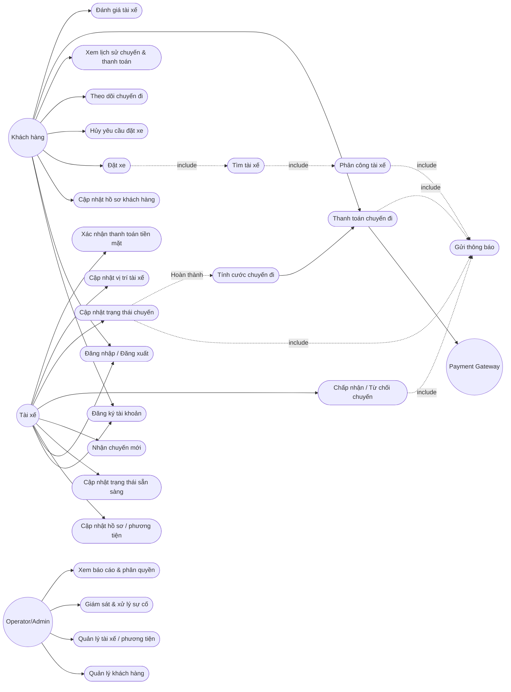
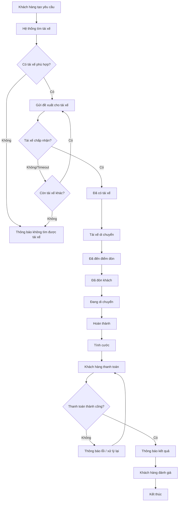
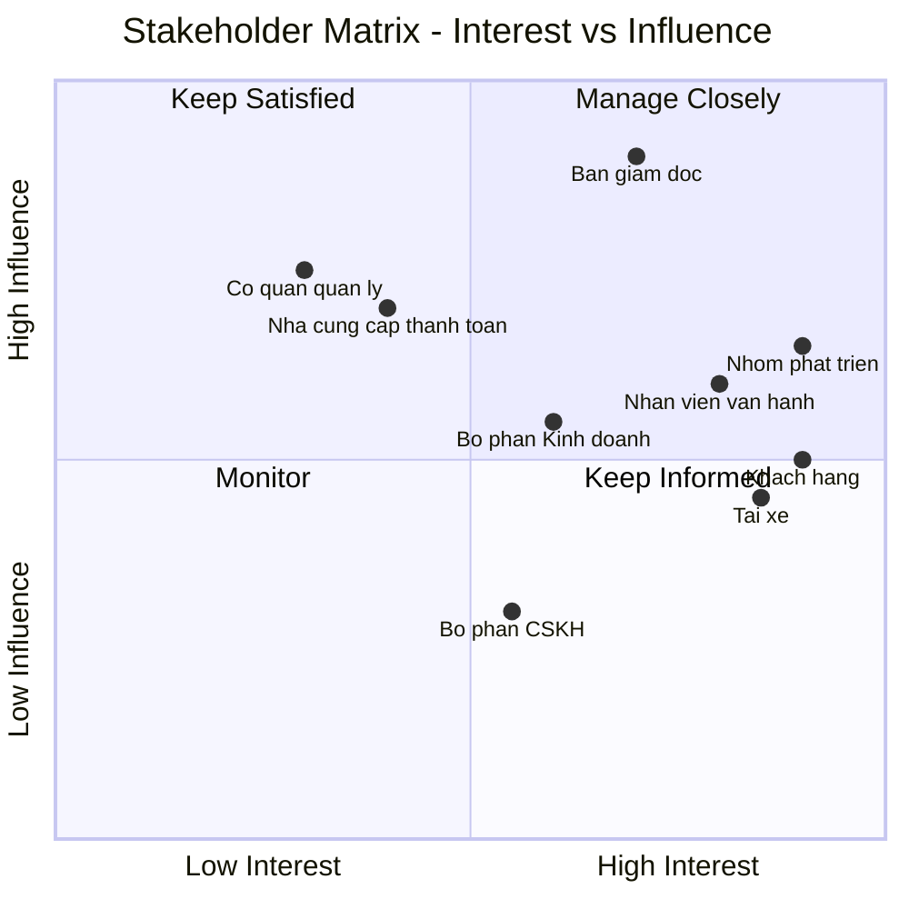
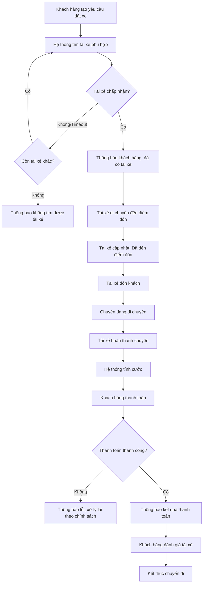

# CAB SYSTEM – NỀN TẢNG ĐẶT XE TRỰC TUYẾN

## Tài liệu phân tích nghiệp vụ (Business Analysis Document)

**Dự án:** Xây dựng CAB System cho Công ty ABC
**Thời gian triển khai:** 7 tuần
**Phạm vi:** MVP (Minimum Viable Product)
**Người thực hiện:** Business Analyst

---

# 1. Vấn đề hiện tại (Problem Statement)

Công ty ABC hiện đang vận hành dịch vụ đặt xe theo mô hình thủ công/bán tự động, tồn tại các vấn đề chính:

| # | Vấn đề                                                                        | Ảnh hưởng                                                    |
| - | -------------------------------------------------------------------------------- | --------------------------------------------------------------- |
| 1 | Phân công tài xế thực hiện thủ công qua tổng đài                      | Chậm, dễ sai sót, không tối ưu tài xế gần khách nhất |
| 2 | Khách hàng không theo dõi được trạng thái chuyến theo thời gian thực | Trải nghiệm kém, tăng số cuộc gọi hỗ trợ               |
| 3 | Thông tin thanh toán không được quản lý tập trung                       | Khó đối soát doanh thu, khó kiểm soát công nợ          |
| 4 | Hệ thống hiện tại khó mở rộng                                             | Không đáp ứng tốt khi lượng khách/tài xế tăng        |
| 5 | Không có công cụ báo cáo, giám sát vận hành tập trung                 | Ban lãnh đạo thiếu dữ liệu để ra quyết định          |

**Tóm tắt:** Doanh nghiệp cần một nền tảng CAB tự động hóa quy trình đặt xe – phân công tài xế – theo dõi chuyến đi – tính cước – thanh toán – thông báo – báo cáo, đồng thời có kiến trúc đủ mở để mở rộng trong các giai đoạn sau.

---

# 2. Mục tiêu hệ thống

1. Tự động hóa quy trình đặt và điều phối chuyến xe.
2. Giảm thao tác thủ công trong việc tìm và phân công tài xế.
3. Cho phép khách hàng theo dõi trạng thái chuyến đi.
4. Tự động tính cước và hỗ trợ thanh toán tiền mặt/điện tử.
5. Cung cấp giao diện quản trị và giám sát vận hành.
6. Cung cấp báo cáo cơ bản về chuyến đi và doanh thu.
7. Đảm bảo xác thực, phân quyền và lưu vết các thao tác quan trọng.
8. Thiết kế hệ thống theo hướng các thành phần có thể mở rộng độc lập.

---

# 3. Các bên liên quan (Stakeholders)

| Tên / Nhóm                            | Vai trò trong hệ thống                                                        |
| --------------------------------------- | -------------------------------------------------------------------------------- |
| Ban giám đốc Công ty ABC            | Phê duyệt phạm vi, ngân sách, định hướng chiến lược                  |
| Khách hàng (Passenger)                | Đặt xe, theo dõi chuyến, thanh toán, đánh giá tài xế                   |
| Tài xế (Driver)                       | Nhận/chấp nhận chuyến, thực hiện chuyến, cập nhật trạng thái/vị trí |
| Nhân viên vận hành (Operator/Admin) | Quản lý khách hàng, tài xế, phương tiện, giám sát và xử lý sự cố |
| Bộ phận kinh doanh/Marketing          | Sử dụng báo cáo chuyến đi và doanh thu                                    |
| Payment Gateway                         | Xử lý giao dịch thanh toán điện tử                                        |
| Nhóm phát triển (Dev Team/BA/PM)     | Phân tích, thiết kế, xây dựng và triển khai                              |
| Bộ phận CSKH                          | Hỗ trợ khi có khiếu nại/sự cố                                             |
| Cơ quan quản lý/tuân thủ           | Yêu cầu về bảo mật dữ liệu và lưu vết giao dịch                       |

---

# 4. Business Units

| Business Unit            | Chức năng chính                                          |
| ------------------------ | ----------------------------------------------------------- |
| Vận hành (Operations)  | Quản lý tài xế, phương tiện, chuyến đi, giám sát |
| Chăm sóc khách hàng  | Xử lý khiếu nại và hỗ trợ                            |
| Tài chính – Kế toán | Tính cước, thanh toán, đối soát doanh thu            |
| Kinh doanh               | Phân tích số liệu và hiệu quả dịch vụ              |
| IT/Engineering           | Phát triển, vận hành và bảo trì                      |
| Pháp chế/Tuân thủ    | Bảo mật dữ liệu, lưu vết thao tác                    |

---

# 5. Phạm vi dự án trong 7 tuần (Project Scope)

## 5.1 Trong phạm vi (In-scope)

- Đăng ký/đăng nhập Khách hàng và Tài xế.
- Cập nhật hồ sơ và thông tin phương tiện.
- Khách hàng tạo yêu cầu đặt xe.
- Chọn điểm đón, điểm đến và loại xe.
- Tính cước ước tính.
- Tự động tìm và phân công tài xế.
- Xử lý tài xế từ chối/không phản hồi.
- Theo dõi trạng thái chuyến.
- Cập nhật vị trí tài xế.
- Tính cước sau khi hoàn thành chuyến.
- Thanh toán tiền mặt.
- Thanh toán điện tử qua một Payment Gateway.
- Thông báo các mốc quan trọng.
- Quản trị khách hàng/tài xế/phương tiện/chuyến đi.
- Giám sát và xử lý sự cố.
- Báo cáo cơ bản.
- Audit log ở mức cơ bản.

## 5.2 Ngoài phạm vi (Out-of-scope)

- Ví điện tử nội bộ.
- Machine Learning cho matching.
- SMS/email marketing đa nhà cung cấp.
- Bản đồ/ETA nâng cao bằng AI.
- Chatbot CSKH.
- Khuyến mãi, mã giảm giá, tích điểm.
- Đa ngôn ngữ, đa tiền tệ.
- BI/dashboard chuyên sâu.

## 5.3 Open Items

1. Công thức tính cước cụ thể.
2. Tiêu chí ưu tiên tài xế ngoài khoảng cách.
3. Thời gian tài xế phải phản hồi.
4. Chính sách hủy chuyến.
5. Xử lý mất kết nối.
6. Thời gian lưu trữ dữ liệu.
7. Chính sách retry khi thanh toán điện tử thất bại.

---

# 6. Yêu cầu nghiệp vụ (Business Requirements – BR)

| Mã   | Yêu cầu                              |
| ----- | -------------------------------------- |
| BR-01 | Quản lý tài khoản người dùng    |
| BR-02 | Đặt xe trực tuyến                  |
| BR-03 | Tự động phân công tài xế        |
| BR-04 | Theo dõi chuyến đi thời gian thực |
| BR-05 | Tính cước và thanh toán           |
| BR-06 | Bảo mật dữ liệu thanh toán        |
| BR-07 | Thông báo đa mốc sự kiện         |
| BR-08 | Quản trị vận hành                  |
| BR-09 | Phân quyền truy cập                 |
| BR-10 | Báo cáo vận hành & kinh doanh      |
| BR-11 | Khả năng mở rộng hệ thống        |
| BR-12 | Bảo mật & lưu vết                  |

---

# 7. Yêu cầu chức năng (Functional Requirements)

## 7.1 Quản lý tài khoản

- FR-01.1 Đăng ký tài khoản Khách hàng.
- FR-01.2 Khởi tạo tài khoản Tài xế.
- FR-01.3 Đăng nhập/Đăng xuất.
- FR-01.4 Cập nhật hồ sơ Khách hàng.
- FR-01.5 Cập nhật hồ sơ/phương tiện Tài xế.
- FR-01.6 Bật/tắt trạng thái sẵn sàng của Tài xế.

## 7.2 Đặt xe

- FR-02.1 Nhập điểm đón.
- FR-02.2 Nhập điểm đến.
- FR-02.3 Chọn loại xe/dịch vụ.
- FR-02.4 Tính và hiển thị cước ước tính.
- FR-02.5 Gửi yêu cầu đặt xe.
- FR-02.6 Hủy yêu cầu khi còn cho phép.

## 7.3 Tìm & phân công tài xế

- FR-03.1 Xác định vị trí khách hàng.
- FR-03.2 Lấy danh sách tài xế sẵn sàng.
- FR-03.3 Xếp hạng tài xế.
- FR-03.4 Gửi đề xuất chuyến.
- FR-03.5 Chuyển sang tài xế kế tiếp.
- FR-03.6 Thông báo khi không tìm được tài xế.

## 7.4 Theo dõi chuyến đi

- FR-04.1 Cập nhật trạng thái chuyến.
- FR-04.2 Cập nhật vị trí tài xế.
- FR-04.3 Hiển thị trạng thái cho khách hàng.
- FR-04.4 Hiển thị ETA ở mức cơ bản nếu dữ liệu cho phép.

## 7.5 Tính cước & thanh toán

- FR-05.1 Tính cước sau khi hoàn thành chuyến.
- FR-05.2 Thanh toán tiền mặt.
- FR-05.3 Thanh toán điện tử.
- FR-05.4 Xử lý giao dịch thất bại.
- FR-05.5 Xem lịch sử chuyến và thanh toán.

## 7.6 Thông báo

- FR-06.1 Thông báo tiếp nhận yêu cầu.
- FR-06.2 Thông báo tài xế nhận chuyến.
- FR-06.3 Thông báo tài xế đến điểm đón.
- FR-06.4 Thông báo hoàn thành chuyến.
- FR-06.5 Thông báo kết quả thanh toán.
- FR-06.6 Thông báo chuyến mới/thay đổi cho tài xế.

## 7.7 Quản trị

- FR-07.1 Quản lý khách hàng.
- FR-07.2 Quản lý tài xế.
- FR-07.3 Quản lý phương tiện.
- FR-07.4 Xem chuyến đang diễn ra.
- FR-07.5 Xử lý chuyến gặp sự cố.
- FR-07.6 Tra cứu lịch sử giao dịch.
- FR-07.7 Phân quyền.

## 7.8 Báo cáo

- FR-08.1 Báo cáo số chuyến.
- FR-08.2 Báo cáo doanh thu.
- FR-08.3 Báo cáo hoàn thành/hủy.
- FR-08.4 Báo cáo hiệu quả tài xế.

## 7.9 Đánh giá

- FR-09.1 Khách hàng đánh giá tài xế sau chuyến hoàn thành.

---

# 8. Use Case Diagram

Hệ thống gồm 24 Use Case chính, được phân theo tác nhân và nhóm nghiệp vụ.



---

# 9. Danh mục Use Case

| Mã   | Use Case                            | Actor                    | Nhóm          |
| ----- | ----------------------------------- | ------------------------ | -------------- |
| UC-01 | Đăng ký tài khoản              | Customer/Driver          | Account        |
| UC-02 | Đăng nhập/Đăng xuất           | Customer/Driver          | Account        |
| UC-03 | Cập nhật hồ sơ khách hàng     | Customer                 | Account        |
| UC-04 | Đặt xe                            | Customer                 | Booking        |
| UC-05 | Hủy yêu cầu đặt xe             | Customer                 | Booking        |
| UC-06 | Theo dõi chuyến đi               | Customer                 | Trip           |
| UC-07 | Xem lịch sử chuyến & thanh toán | Customer                 | History        |
| UC-08 | Thanh toán chuyến đi             | Customer/Payment Gateway | Payment        |
| UC-09 | Đánh giá tài xế                | Customer                 | Rating         |
| UC-10 | Cập nhật hồ sơ/phương tiện   | Driver                   | Driver         |
| UC-11 | Cập nhật trạng thái sẵn sàng  | Driver                   | Driver         |
| UC-12 | Nhận chuyến mới                  | Driver                   | Matching       |
| UC-13 | Chấp nhận/Từ chối chuyến       | Driver                   | Matching       |
| UC-14 | Cập nhật trạng thái chuyến     | Driver                   | Trip           |
| UC-15 | Cập nhật vị trí tài xế        | Driver                   | Trip           |
| UC-16 | Xác nhận thanh toán tiền mặt   | Driver                   | Payment        |
| UC-17 | Tìm tài xế                       | System                   | Matching       |
| UC-18 | Phân công tài xế                | System                   | Matching       |
| UC-19 | Tính cước chuyến đi            | System                   | Payment        |
| UC-20 | Gửi thông báo                    | System                   | Notification   |
| UC-21 | Quản lý khách hàng              | Operator/Admin           | Administration |
| UC-22 | Quản lý tài xế/phương tiện   | Operator/Admin           | Administration |
| UC-23 | Giám sát & xử lý sự cố        | Operator/Admin           | Operations     |
| UC-24 | Xem báo cáo & phân quyền        | Operator/Admin           | Reporting      |

---

# 10. Đặc tả Use Case (Use Case Specification)

> Các Use Case quan trọng của nghiệp vụ được đặc tả chi tiết. Các UC CRUD đơn giản có thể sử dụng cùng chuẩn đặc tả và rút gọn khi cần.

## UC-01: Đăng ký tài khoản

| Mục               | Nội dung                                                                                                                                                        |
| ------------------ | ---------------------------------------------------------------------------------------------------------------------------------------------------------------- |
| Mã                | UC-01                                                                                                                                                            |
| Tên               | Đăng ký tài khoản                                                                                                                                           |
| Actor              | Khách hàng/Tài xế                                                                                                                                            |
| Mô tả            | Tạo tài khoản để sử dụng hệ thống                                                                                                                       |
| Tiền điều kiện | Người dùng chưa có tài khoản                                                                                                                              |
| Hậu điều kiện  | Tài khoản được tạo ở trạng thái phù hợp                                                                                                               |
| Luồng chính      | 1. Chọn đăng ký → 2. Chọn loại tài khoản → 3. Nhập thông tin → 4. Hệ thống kiểm tra dữ liệu → 5. Tạo tài khoản → 6. Thông báo kết quả |
| Luồng thay thế   | Email/số điện thoại đã tồn tại → thông báo và yêu cầu nhập lại                                                                                   |
| Ngoại lệ         | Dữ liệu không hợp lệ → từ chối đăng ký                                                                                                                |
| Quy tắc           | Tài khoản phải có thông tin xác thực hợp lệ                                                                                                             |

## UC-02: Đăng nhập/Đăng xuất

| Mục               | Nội dung                                                                        |
| ------------------ | -------------------------------------------------------------------------------- |
| Mã                | UC-02                                                                            |
| Actor              | Khách hàng/Tài xế                                                            |
| Tiền điều kiện | Có tài khoản hoạt động                                                     |
| Hậu điều kiện  | Tạo phiên đăng nhập hoặc kết thúc phiên                                 |
| Luồng chính      | Nhập thông tin → xác thực → cấp quyền truy cập → sử dụng hệ thống  |
| Ngoại lệ         | Sai thông tin → thông báo lỗi; tài khoản bị khóa → từ chối truy cập |

## UC-03: Cập nhật hồ sơ khách hàng

| Mục               | Nội dung                                                                       |
| ------------------ | ------------------------------------------------------------------------------- |
| Actor              | Khách hàng                                                                    |
| Tiền điều kiện | Đã đăng nhập                                                               |
| Luồng chính      | Mở hồ sơ → sửa thông tin → kiểm tra → lưu → thông báo thành công |
| Ngoại lệ         | Dữ liệu không hợp lệ → không lưu                                        |

## UC-04: Đặt xe (Book a Ride)

| Mục                  | Nội dung                                                                                                                                                                                                          |
| --------------------- | ------------------------------------------------------------------------------------------------------------------------------------------------------------------------------------------------------------------ |
| Mã                   | UC-04                                                                                                                                                                                                              |
| Actor chính          | Khách hàng                                                                                                                                                                                                       |
| Actor phụ            | Hệ thống                                                                                                                                                                                                         |
| Mô tả               | Khách hàng tạo yêu cầu bằng điểm đón, điểm đến và loại xe                                                                                                                                          |
| Tiền điều kiện    | Đã đăng nhập; tài khoản hoạt động                                                                                                                                                                        |
| Hậu điều kiện     | Yêu cầu ở trạng thái “Đang tìm tài xế”                                                                                                                                                                  |
| Luồng chính         | 1. Nhập điểm đón → 2. Nhập điểm đến → 3. Chọn loại xe → 4. Hệ thống tính cước ước tính → 5. Khách hàng xác nhận → 6. Tạo yêu cầu → 7. Gửi thông báo → 8. Kích hoạt matching |
| Luồng thay thế      | Khách hàng hủy trước khi có tài xế → chuyển “Đã hủy”                                                                                                                                                |
| Ngoại lệ            | Địa điểm không hợp lệ; không có loại xe phù hợp                                                                                                                                                        |
| Yêu cầu đặc biệt | Hiển thị cước ước tính mục tiêu dưới 3 giây                                                                                                                                                            |

## UC-05: Hủy yêu cầu đặt xe

| Mục               | Nội dung                                                                                             |
| ------------------ | ----------------------------------------------------------------------------------------------------- |
| Actor              | Khách hàng                                                                                          |
| Tiền điều kiện | Yêu cầu chưa bị khóa bởi trạng thái chuyến                                                   |
| Luồng chính      | Chọn hủy → xác nhận → hệ thống kiểm tra chính sách → chuyển “Đã hủy” → thông báo |
| Ngoại lệ         | Không còn được phép hủy → từ chối và thông báo                                           |
| Open Item          | Phí và thời điểm hủy cần xác nhận                                                            |

## UC-06: Theo dõi chuyến đi

| Mục               | Nội dung                                                                                                        |
| ------------------ | ---------------------------------------------------------------------------------------------------------------- |
| Actor              | Khách hàng                                                                                                     |
| Tiền điều kiện | Có chuyến đang hoạt động                                                                                   |
| Luồng chính      | Mở chuyến → hệ thống lấy trạng thái/vị trí → hiển thị trạng thái → cập nhật khi có thay đổi |
| Ngoại lệ         | Mất kết nối → hiển thị dữ liệu gần nhất và xử lý theo chính sách                                  |
| Kết quả          | Khách hàng biết được trạng thái hiện tại của chuyến                                                  |

## UC-07: Xem lịch sử chuyến & thanh toán

| Mục               | Nội dung                                                                                              |
| ------------------ | ------------------------------------------------------------------------------------------------------ |
| Actor              | Khách hàng                                                                                           |
| Tiền điều kiện | Đã đăng nhập                                                                                      |
| Luồng chính      | Mở lịch sử → hệ thống truy vấn chuyến → chọn chuyến → xem chi tiết cước và thanh toán |
| Ngoại lệ         | Không có dữ liệu → hiển thị danh sách rỗng                                                    |

## UC-08: Thanh toán chuyến đi

| Mục                  | Nội dung                                                                                                                                                                                                          |
| --------------------- | ------------------------------------------------------------------------------------------------------------------------------------------------------------------------------------------------------------------ |
| Mã                   | UC-08                                                                                                                                                                                                              |
| Actor chính          | Khách hàng                                                                                                                                                                                                       |
| Actor phụ            | Payment Gateway/Tài xế                                                                                                                                                                                           |
| Tiền điều kiện    | Chuyến “Hoàn thành”, cước đã tính                                                                                                                                                                        |
| Hậu điều kiện     | Giao dịch thành công và chuyến “Đã thanh toán”                                                                                                                                                           |
| Luồng chính         | 1. Hiển thị số tiền → 2. Chọn phương thức → 3. Tiền mặt: tài xế xác nhận nhận tiền / Điện tử: gửi Payment Gateway → 4. Nhận kết quả → 5. Cập nhật trạng thái → 6. Gửi thông báo |
| Luồng thay thế      | Thanh toán điện tử thất bại → thông báo và cho phép thử lại/đổi phương thức theo chính sách                                                                                                    |
| Yêu cầu đặc biệt | Không lưu thông tin thẻ/tài khoản nhạy cảm trong CAB                                                                                                                                                       |

## UC-09: Đánh giá tài xế

| Mục               | Nội dung                                                                                     |
| ------------------ | --------------------------------------------------------------------------------------------- |
| Actor              | Khách hàng                                                                                  |
| Tiền điều kiện | Chuyến đã hoàn thành                                                                     |
| Luồng chính      | Mở chuyến → chọn mức đánh giá → nhập nhận xét nếu có → gửi → hệ thống lưu |
| Ngoại lệ         | Chuyến chưa hoàn thành → không cho đánh giá                                          |

## UC-10: Cập nhật hồ sơ/phương tiện

| Mục               | Nội dung                                                                              |
| ------------------ | -------------------------------------------------------------------------------------- |
| Actor              | Tài xế                                                                               |
| Tiền điều kiện | Đã đăng nhập                                                                      |
| Luồng chính      | Mở hồ sơ → cập nhật thông tin → cập nhật phương tiện → kiểm tra → lưu |
| Ngoại lệ         | Dữ liệu phương tiện không hợp lệ → từ chối cập nhật                       |

## UC-11: Cập nhật trạng thái sẵn sàng

| Mục               | Nội dung                                                                            |
| ------------------ | ------------------------------------------------------------------------------------ |
| Actor              | Tài xế                                                                             |
| Tiền điều kiện | Đã đăng nhập                                                                    |
| Luồng chính      | Chọn Online/Offline → hệ thống kiểm tra điều kiện → cập nhật trạng thái |
| Quy tắc           | Chỉ tài xế “sẵn sàng” mới được matching                                   |

## UC-12: Nhận chuyến mới

| Mục               | Nội dung                                                                                        |
| ------------------ | ------------------------------------------------------------------------------------------------ |
| Actor              | Tài xế                                                                                         |
| Tiền điều kiện | Tài xế đang sẵn sàng                                                                        |
| Luồng chính      | Nhận thông báo → mở thông tin chuyến → xem điểm đón/đến và thông tin cần thiết |
| Kết quả          | Tài xế có thể chuyển sang UC-13                                                             |

## UC-13: Chấp nhận/Từ chối chuyến

| Mục               | Nội dung                                                                                               |
| ------------------ | ------------------------------------------------------------------------------------------------------- |
| Actor              | Tài xế                                                                                                |
| Tiền điều kiện | Có đề xuất chuyến còn hiệu lực                                                                  |
| Luồng chính      | Xem đề xuất → chọn Chấp nhận → hệ thống gán chuyến → thông báo khách hàng              |
| Luồng thay thế   | Chọn Từ chối → hệ thống loại tài xế khỏi yêu cầu hiện tại → matching tài xế tiếp theo |
| Ngoại lệ         | Hết thời gian phản hồi → xử lý như không phản hồi                                            |
| Open Item          | Thời gian phản hồi cụ thể cần xác nhận                                                          |

## UC-14: Cập nhật trạng thái chuyến đi

| Mục               | Nội dung                                                                                                   |
| ------------------ | ----------------------------------------------------------------------------------------------------------- |
| Mã                | UC-14                                                                                                       |
| Actor              | Tài xế                                                                                                    |
| Tiền điều kiện | Đã chấp nhận chuyến                                                                                    |
| Luồng chính      | Cập nhật: Đang đến → Đã đến điểm đón → Đã đón khách → Đang di chuyển → Hoàn thành |
| Hệ thống         | Ghi thời gian từng mốc và gửi thông báo                                                              |
| Ngoại lệ         | Cập nhật sai thứ tự → từ chối                                                                        |
| Kích hoạt        | Khi “Hoàn thành” → kích hoạt UC-19                                                                   |

## UC-15: Cập nhật vị trí tài xế

| Mục               | Nội dung                                                                                                      |
| ------------------ | -------------------------------------------------------------------------------------------------------------- |
| Actor              | Tài xế                                                                                                       |
| Tiền điều kiện | Có chuyến đang hoạt động và thiết bị cho phép gửi vị trí                                          |
| Luồng chính      | Thiết bị gửi vị trí → hệ thống kiểm tra → cập nhật vị trí → cung cấp cho khách hàng/operator |
| Ngoại lệ         | Mất kết nối → giữ dữ liệu gần nhất và đồng bộ lại khi có kết nối                              |

## UC-16: Xác nhận thanh toán tiền mặt

| Mục               | Nội dung                                                                                                     |
| ------------------ | ------------------------------------------------------------------------------------------------------------- |
| Actor              | Tài xế                                                                                                      |
| Tiền điều kiện | Phương thức thanh toán là tiền mặt                                                                     |
| Luồng chính      | Khách hàng thanh toán → tài xế xác nhận nhận tiền → hệ thống ghi nhận giao dịch → thông báo |
| Ngoại lệ         | Tài xế chưa xác nhận → giao dịch chưa hoàn tất                                                      |

## UC-17: Tìm tài xế

| Mục               | Nội dung                                                                                                                                                  |
| ------------------ | ---------------------------------------------------------------------------------------------------------------------------------------------------------- |
| Actor chính       | Hệ thống                                                                                                                                                 |
| Tiền điều kiện | Có yêu cầu “Đang tìm tài xế”                                                                                                                      |
| Luồng chính      | 1. Xác định vị trí khách → 2. Lấy tài xế sẵn sàng → 3. Lọc → 4. Xếp hạng theo khoảng cách/tiêu chí → 5. Chuyển danh sách cho UC-18 |
| Ngoại lệ         | Không có tài xế phù hợp → chuyển trạng thái “Không tìm được tài xế”                                                                     |

## UC-18: Phân công tài xế

| Mục               | Nội dung                                                                                    |
| ------------------ | -------------------------------------------------------------------------------------------- |
| Actor chính       | Hệ thống                                                                                   |
| Tiền điều kiện | Có danh sách tài xế phù hợp                                                            |
| Luồng chính      | Gửi đề xuất cho tài xế đầu tiên → chờ phản hồi → chấp nhận thì gán chuyến |
| Luồng thay thế   | Từ chối/timeout → chuyển tài xế kế tiếp                                              |
| Ngoại lệ         | Hết danh sách → thông báo khách hàng                                                  |

## UC-19: Tính cước chuyến đi

| Mục               | Nội dung                                                                                                            |
| ------------------ | -------------------------------------------------------------------------------------------------------------------- |
| Actor              | Hệ thống                                                                                                           |
| Tiền điều kiện | Chuyến đã hoàn thành                                                                                            |
| Luồng chính      | Lấy loại dịch vụ + dữ liệu chuyến → áp dụng công thức → tạo số tiền phải thanh toán → lưu cước |
| Quy tắc           | Chỉ tính cước sau trạng thái “Hoàn thành”                                                                  |
| Open Item          | Công thức tính cước cần xác nhận                                                                             |

## UC-20: Gửi thông báo

| Mục          | Nội dung                                                                              |
| ------------- | -------------------------------------------------------------------------------------- |
| Actor         | Hệ thống                                                                             |
| Kích hoạt   | Các sự kiện nghiệp vụ                                                             |
| Sự kiện     | Tạo yêu cầu, nhận chuyến, tài xế đến, hoàn thành, thanh toán               |
| Luồng chính | Xác định người nhận → tạo nội dung → gửi in-app/push → ghi nhận kết quả |
| Ngoại lệ    | Gửi thất bại không được làm dừng quy trình đặt xe                          |

## UC-21: Quản lý khách hàng

| Mục               | Nội dung                                                |
| ------------------ | -------------------------------------------------------- |
| Actor              | Operator/Admin                                           |
| Tiền điều kiện | Đã đăng nhập và có quyền                         |
| Chức năng        | Xem, tìm kiếm, cập nhật, khóa/mở khóa theo quyền |
| Ngoại lệ         | Không có quyền → từ chối                           |

## UC-22: Quản lý tài xế/phương tiện

| Mục               | Nội dung                                                           |
| ------------------ | ------------------------------------------------------------------- |
| Actor              | Operator/Admin                                                      |
| Tiền điều kiện | Đã đăng nhập và có quyền                                    |
| Chức năng        | Xem/tìm kiếm/cập nhật tài xế, phương tiện và trạng thái |
| Ngoại lệ         | Không có quyền hoặc dữ liệu không hợp lệ                   |

## UC-23: Giám sát & xử lý sự cố

| Mục               | Nội dung                                                                                                       |
| ------------------ | --------------------------------------------------------------------------------------------------------------- |
| Actor              | Operator/Admin                                                                                                  |
| Tiền điều kiện | Có quyền vận hành                                                                                           |
| Luồng chính      | Xem chuyến đang diễn ra → phát hiện sự cố → xem chi tiết → thực hiện thao tác hỗ trợ → ghi log |
| Ví dụ sự cố    | Tài xế không phản hồi, chuyến bị treo, mất kết nối, khiếu nại                                       |
| Kết quả          | Sự cố được xử lý hoặc chuyển CSKH                                                                      |

## UC-24: Xem báo cáo & phân quyền

| Mục        | Nội dung                                                                                                        |
| ----------- | ---------------------------------------------------------------------------------------------------------------- |
| Actor       | Operator/Admin/Người được phân quyền                                                                      |
| Chức năng | Xem báo cáo số chuyến, doanh thu, hoàn thành/hủy, hiệu quả tài xế; quản lý quyền nếu được cấp |
| Quy tắc    | Chỉ người có quyền phù hợp mới xem/thao tác dữ liệu nhạy cảm                                        |
| Báo cáo   | Có thể lọc theo khoảng thời gian                                                                            |

---

# 11. Quy trình nghiệp vụ tổng thể



---

# 12. Trạng thái chuyến đi

```text
Đang tìm tài xế
       |
       v
Đã có tài xế
       |
       v
Tài xế đang đến
       |
       v
Đã đến điểm đón
       |
       v
Đã đón khách
       |
       v
Đang di chuyển
       |
       v
Hoàn thành
       |
       v
Đã thanh toán
```

Các trạng thái kết thúc/bất thường:

```text
Đã hủy
Không tìm được tài xế
Sự cố
```

---

# 13. Business Rules

| Mã      | Quy tắc                                                                                 |
| -------- | ---------------------------------------------------------------------------------------- |
| BRule-01 | Người dùng phải đăng nhập trước khi sử dụng chức năng yêu cầu tài khoản |
| BRule-02 | Chỉ tài xế “sẵn sàng” mới được đề xuất chuyến                             |
| BRule-03 | Tài xế từ chối/không phản hồi → chuyển sang tài xế kế tiếp                  |
| BRule-04 | Không tìm được tài xế → thông báo khách hàng                                 |
| BRule-05 | Chỉ tính cước sau khi chuyến “Hoàn thành”                                       |
| BRule-06 | Cước phụ thuộc loại dịch vụ và thông tin chuyến                                |
| BRule-07 | Không lưu thông tin nhạy cảm của thẻ/tài khoản trong CAB                        |
| BRule-08 | Thanh toán điện tử thất bại → thông báo và cho phép xử lý lại              |
| BRule-09 | Chức năng quản trị nhạy cảm phải được phân quyền                             |
| BRule-10 | Thao tác quan trọng phải được ghi audit log                                        |
| BRule-11 | Lỗi thanh toán/thông báo không được làm dừng toàn hệ thống                  |
| BRule-12 | Chính sách hủy chuyến cần được xác nhận                                        |
| BRule-13 | Mất kết nối cần có cơ chế xử lý và đồng bộ                                  |
| BRule-14 | Thời gian lưu trữ dữ liệu cần được xác nhận                                   |

---

# 14. Ma trận Actor – Use Case

| Actor           | Use Case chính                       |
| --------------- | ------------------------------------- |
| Khách hàng    | UC-01, 02, 03, 04, 05, 06, 07, 08, 09 |
| Tài xế        | UC-01, 02, 10, 11, 12, 13, 14, 15, 16 |
| Hệ thống      | UC-17, 18, 19, 20                     |
| Operator/Admin  | UC-21, 22, 23, 24                     |
| Payment Gateway | UC-08                                 |

---

# 15. Ma trận BR – Functional Requirement – Use Case

| Business Requirement | Functional Requirement | Use Case                                 |
| -------------------- | ---------------------- | ---------------------------------------- |
| BR-01                | FR-01.x                | UC-01, UC-02, UC-03, UC-10, UC-11        |
| BR-02                | FR-02.x                | UC-04, UC-05                             |
| BR-03                | FR-03.x                | UC-17, UC-18, UC-12, UC-13               |
| BR-04                | FR-04.x                | UC-06, UC-14, UC-15                      |
| BR-05                | FR-05.x                | UC-08, UC-16, UC-19                      |
| BR-06                | FR-05.3/05.4           | UC-08                                    |
| BR-07                | FR-06.x                | UC-20                                    |
| BR-08                | FR-07.x                | UC-21, UC-22, UC-23                      |
| BR-09                | FR-07.7                | UC-24                                    |
| BR-10                | FR-08.x                | UC-24                                    |
| BR-11                | Kiến trúc hệ thống | Các module độc lập                   |
| BR-12                | Audit/authentication   | UC-01, UC-02, UC-21, UC-22, UC-23, UC-24 |

---

# 16. Audit Log

Các thao tác cần ghi log tối thiểu:

- Đăng nhập/đăng xuất quan trọng.
- Thay đổi trạng thái chuyến.
- Chấp nhận/từ chối chuyến.
- Thanh toán.
- Thay đổi dữ liệu khách hàng/tài xế/phương tiện quan trọng.
- Thao tác quản trị.
- Thay đổi phân quyền.
- Xử lý sự cố.

Thông tin log đề xuất:

```text
logId
actorId
actorRole
action
targetType
targetId
timestamp
result
metadata
```

---

# 17. Yêu cầu phi chức năng (Non-Functional Requirements)

## 17.1 Hiệu năng

- Cước ước tính mục tiêu phản hồi dưới 3 giây.
- Các API thông thường cần phản hồi ổn định trong điều kiện tải MVP.
- Cập nhật trạng thái phải được đồng bộ nhanh đến các bên liên quan.

## 17.2 Bảo mật

- Xác thực người dùng.
- Phân quyền theo vai trò.
- Không lưu thông tin thẻ nhạy cảm.
- Ghi audit log.
- Bảo vệ API khỏi truy cập trái phép.

## 17.3 Khả năng mở rộng

- Module đặt xe, matching, payment, notification và reporting nên có ranh giới tương đối độc lập.
- Một lỗi ở notification/payment không làm dừng hoàn toàn booking.

## 17.4 Khả năng bảo trì

- API có cấu trúc thống nhất.
- Dữ liệu và trạng thái chuyến phải có quy ước rõ ràng.
- Các lỗi phải trả về mã/trạng thái nhất quán.

---

# 18. API định hướng cho Swagger/OpenAPI

Các nhóm API dự kiến:

```text
/auth
    POST /register
    POST /login
    POST /logout

/customers
    GET  /customers/{id}
    PUT  /customers/{id}

/drivers
    GET  /drivers/{id}
    PUT  /drivers/{id}
    PUT  /drivers/{id}/availability
    PUT  /drivers/{id}/location

/rides
    POST /rides
    GET  /rides/{id}
    DELETE /rides/{id}
    GET  /rides/{id}/status

/matching
    POST /rides/{id}/matching
    POST /rides/{id}/assign
    POST /rides/{id}/driver-response

/trips
    PUT /trips/{id}/status
    GET  /trips/{id}

/payments
    POST /payments
    GET  /payments/{id}

/notifications
    GET  /notifications
    POST /notifications

/ratings
    POST /rides/{id}/rating

/admin
    GET  /customers
    GET  /drivers
    GET  /vehicles
    GET  /trips
    GET  /trips/incidents

/reports
    GET /reports/trips
    GET /reports/revenue
    GET /reports/cancellation
    GET /reports/drivers
```

> Đây là API định hướng phục vụ thiết kế Swagger/OpenAPI; endpoint thực tế có thể điều chỉnh khi thiết kế kiến trúc và database.

---

# 19. Các Open Items cần xác nhận

| # | Nội dung                      | Trạng thái     |
| - | ------------------------------ | ---------------- |
| 1 | Công thức tính cước       | Chưa xác nhận |
| 2 | Tiêu chí ưu tiên tài xế  | Chưa xác nhận |
| 3 | Timeout phản hồi tài xế    | Chưa xác nhận |
| 4 | Phí/thời điểm hủy chuyến | Chưa xác nhận |
| 5 | Xử lý mất kết nối         | Chưa xác nhận |
| 6 | Thời gian lưu trữ dữ liệu | Chưa xác nhận |
| 7 | Retry thanh toán điện tử   | Chưa xác nhận |

---

# 20. Kết luận

CAB System trong phạm vi MVP tập trung vào chuỗi nghiệp vụ cốt lõi:

**Đặt xe → Tìm tài xế → Phân công → Thực hiện chuyến → Tính cước → Thanh toán → Đánh giá**

Tài liệu được tổ chức theo hướng từ **Business Requirement → Functional Requirement → Use Case → Business Process → Business Rule → API**, giúp làm cơ sở cho các bước tiếp theo gồm thiết kế hệ thống, thiết kế cơ sở dữ liệu, thiết kế API Swagger/OpenAPI và triển khai Docker.

Trong phạm vi 7 tuần, các chức năng nâng cao như AI matching, chatbot, BI chuyên sâu, đa phương thức thanh toán và chương trình khuyến mãi được giữ ngoài phạm vi MV

# CAB SYSTEM – NỀN TẢNG ĐẶT XE TRỰC TUYẾN

## Tài liệu phân tích nghiệp vụ (Business Analysis Document)

**Dự án:** Xây dựng CAB System cho Công ty ABC
**Thời gian triển khai:** 7 tuần
**Người thực hiện:** Business Analyst

---

## 1. Vấn đề hiện tại (Problem Statement)

Công ty ABC hiện đang vận hành dịch vụ đặt xe theo mô hình thủ công/bán tự động, tồn tại các vấn đề chính sau:

| # | Vấn đề                                                                            | Ảnh hưởng                                                                                |
| - | ------------------------------------------------------------------------------------ | ------------------------------------------------------------------------------------------- |
| 1 | Phân công tài xế thực hiện thủ công (qua tổng đài)                        | Chậm, dễ sai sót, không tối ưu được tài xế gần khách nhất                     |
| 2 | Khách hàng không theo dõi được trạng thái chuyến đi theo thời gian thực | Trải nghiệm kém, tăng số cuộc gọi hỗ trợ                                           |
| 3 | Thông tin thanh toán không được quản lý tập trung                           | Khó đối soát doanh thu, khó kiểm soát công nợ                                      |
| 4 | Hệ thống hiện tại khó mở rộng                                                 | Không đáp ứng được khi lượng khách/tài xế tăng, khó bổ sung tính năng mới |
| 5 | Không có công cụ báo cáo, giám sát vận hành tập trung                     | Ban lãnh đạo thiếu dữ liệu ra quyết định                                           |

**Tóm tắt:** Doanh nghiệp cần một nền tảng CAB tự động hóa toàn bộ quy trình đặt xe – phân công tài xế – theo dõi chuyến đi – thanh toán – thông báo – báo cáo, có kiến trúc mở rộng được để phục vụ tăng trưởng dài hạn.

---

## 2. Xác định các bên liên quan (Stakeholders)

### 2.1 Bảng Stakeholder

| Tên / Nhóm                                              | Vai trò trong hệ thống                                                              |
| --------------------------------------------------------- | -------------------------------------------------------------------------------------- |
| Ban giám đốc Công ty ABC                              | Phê duyệt phạm vi, ngân sách, định hướng chiến lược sản phẩm             |
| Khách hàng (Passenger)                                  | Người dùng đặt xe, theo dõi chuyến, thanh toán, đánh giá tài xế           |
| Tài xế (Driver)                                         | Người thực hiện chuyến đi, cập nhật trạng thái, nhận thông báo            |
| Nhân viên vận hành (Operator/Admin)                   | Quản trị khách hàng, tài xế, phương tiện, xử lý sự cố chuyến đi         |
| Bộ phận kinh doanh/Marketing                            | Sử dụng báo cáo doanh thu, chuyến đi để ra quyết định kinh doanh            |
| Nhà cung cấp thanh toán bên thứ ba (Payment Gateway) | Xử lý giao dịch thanh toán điện tử, không lưu thông tin nhạy cảm trong CAB |
| Nhóm phát triển (Dev Team/BA/PM)                       | Phân tích, thiết kế, xây dựng và triển khai hệ thống                         |
| Bộ phận CSKH (Customer Support)                         | Hỗ trợ khách hàng/tài xế khi có khiếu nại, sự cố                            |
| Cơ quan quản lý/tuân thủ (nếu có)                  | Yêu cầu về bảo mật dữ liệu cá nhân, lưu vết giao dịch                      |

### 2.2 Stakeholder Matrix (Mermaid – Quadrant: Interest vs Influence)



---

## 3. Xác định Business Units

| Business Unit                              | Chức năng chính liên quan đến hệ thống                                              |
| ------------------------------------------ | ------------------------------------------------------------------------------------------- |
| Vận hành (Operations)                    | Quản lý tài xế, phương tiện, xử lý chuyến đi bất thường, giám sát real-time |
| Chăm sóc khách hàng (Customer Service) | Xử lý khiếu nại, hỗ trợ khách hàng/tài xế                                         |
| Tài chính – Kế toán (Finance)         | Tính cước, đối soát thanh toán, doanh thu, công nợ tài xế                        |
| Kinh doanh (Business Development)          | Phân tích số liệu chuyến đi, mở rộng dịch vụ, khuyến mãi                        |
| Công nghệ thông tin (IT/Engineering)    | Phát triển, vận hành, bảo trì hệ thống, đảm bảo khả năng mở rộng             |
| Pháp chế/Tuân thủ (Legal & Compliance) | Đảm bảo bảo mật dữ liệu cá nhân, lưu vết thao tác                               |

---

## 4. Phạm vi dự án trong 7 tuần (Project Scope)

Với thời gian 7 tuần, phạm vi được giới hạn ở mức **MVP (Minimum Viable Product)** – một hệ thống đặt xe trực tuyến cơ bản, đủ để vận hành thực tế, các phần nâng cao được đưa vào backlog cho giai đoạn sau.

### 4.1 Trong phạm vi (In-scope)

- Đăng ký/đăng nhập cho Khách hàng và Tài xế (xác thực cơ bản)
- Khách hàng: cập nhật hồ sơ, tạo yêu cầu đặt xe (điểm đón/đến, loại xe), theo dõi trạng thái chuyến, xem lịch sử chuyến, đánh giá tài xế
- Tài xế: cập nhật hồ sơ/phương tiện, bật/tắt trạng thái sẵn sàng, nhận – chấp nhận/từ chối chuyến, cập nhật trạng thái chuyến
- Tìm tài xế tự động theo vị trí gần nhất + trạng thái sẵn sàng; cơ chế tìm tài xế kế tiếp khi bị từ chối/không phản hồi
- Tính cước cơ bản theo loại dịch vụ + quãng đường/thời gian
- Thanh toán: tiền mặt, và tích hợp đơn giản với 1 cổng thanh toán điện tử (không lưu thông tin thẻ trong hệ thống CAB)
- Thông báo cơ bản (in-app/push) cho các mốc: nhận yêu cầu, tài xế nhận chuyến, tài xế đến điểm đón, hoàn thành chuyến, kết quả thanh toán
- Giao diện quản trị cơ bản: quản lý khách hàng/tài xế/phương tiện/chuyến đi, phân quyền tối thiểu (Admin/Operator)
- Báo cáo cơ bản: số chuyến, tỷ lệ hoàn thành/hủy, doanh thu tổng hợp
- Ghi log các thao tác quan trọng (audit log ở mức cơ bản)

### 4.2 Ngoài phạm vi (Out-of-scope – đưa vào giai đoạn sau)

- Đa dạng phương thức thanh toán, ví điện tử nội bộ
- Tối ưu hóa thuật toán ghép tài xế nâng cao (machine learning)
- Đa kênh thông báo (SMS, email marketing, đa nhà cung cấp)
- Ứng dụng thời gian thực nâng cao (bản đồ chi tiết, dự đoán ETA bằng AI)
- Chatbot CSKH, tích hợp tổng đài
- Chương trình khuyến mãi, mã giảm giá, tích điểm
- Đa ngôn ngữ, đa tiền tệ, mở rộng quốc tế
- Báo cáo/BI nâng cao, dashboard phân tích chuyên sâu

### 4.3 Các nội dung cần làm rõ thêm với khách hàng (Open Items)

- Công thức/chính sách tính cước cụ thể
- Tiêu chí ưu tiên tài xế (ngoài khoảng cách)
- Thời gian tối đa tài xế phải phản hồi một yêu cầu
- Chính sách hủy chuyến (phí hủy, thời điểm cho phép hủy)
- Cách xử lý khi mất kết nối mạng (khách hàng/tài xế)
- Thời gian lưu trữ dữ liệu (lịch sử chuyến, vị trí, giao dịch)

---

## 5. Yêu cầu nghiệp vụ (Business Requirements – BR)

| Mã   | Yêu cầu nghiệp vụ                  | Mô tả                                                                                                                                          |
| ----- | -------------------------------------- | ------------------------------------------------------------------------------------------------------------------------------------------------ |
| BR-01 | Quản lý tài khoản người dùng    | Hệ thống phải cho phép Khách hàng và Tài xế đăng ký, đăng nhập, quản lý hồ sơ cá nhân                                       |
| BR-02 | Đặt xe trực tuyến                  | Hệ thống phải cho phép Khách hàng tạo yêu cầu đặt xe với điểm đón, điểm đến, loại xe                                        |
| BR-03 | Tự động phân công tài xế        | Hệ thống phải tự động tìm và đề xuất tài xế phù hợp, xử lý được trường hợp tài xế từ chối/không phản hồi           |
| BR-04 | Theo dõi chuyến đi thời gian thực | Hệ thống phải cho khách hàng biết trạng thái chuyến đi và tài xế theo thời gian thực                                              |
| BR-05 | Tính cước và thanh toán           | Hệ thống phải tính cước tự động sau khi hoàn thành chuyến và hỗ trợ thanh toán tiền mặt/điện tử                             |
| BR-06 | Bảo mật dữ liệu thanh toán        | Hệ thống không lưu trực tiếp thông tin nhạy cảm thanh toán, phải qua nhà cung cấp thanh toán bên ngoài                           |
| BR-07 | Thông báo đa mốc sự kiện         | Hệ thống phải thông báo cho khách hàng/tài xế tại các mốc quan trọng của chuyến đi                                               |
| BR-08 | Quản trị vận hành                  | Hệ thống phải cung cấp công cụ cho nhân viên vận hành quản lý khách hàng, tài xế, phương tiện, chuyến đi                    |
| BR-09 | Phân quyền truy cập                 | Hệ thống phải phân quyền để giới hạn thao tác nhạy cảm chỉ dành cho vai trò phù hợp                                             |
| BR-10 | Báo cáo vận hành & kinh doanh      | Hệ thống phải cung cấp báo cáo về số chuyến, doanh thu, tỷ lệ hoàn thành/hủy, hiệu quả tài xế                                  |
| BR-11 | Khả năng mở rộng hệ thống        | Kiến trúc hệ thống phải cho phép mở rộng độc lập từng thành phần và bổ sung tính năng mà không ảnh hưởng toàn hệ thống |
| BR-12 | Bảo mật & lưu vết                  | Hệ thống phải xác thực người dùng, kiểm soát truy cập và ghi log các thao tác quan trọng                                          |

---

## 6. Phân rã yêu cầu chức năng (Functional Requirements Decomposition)

### 6.1 Nhóm: Quản lý tài khoản (từ BR-01)

- FR-01.1: Đăng ký tài khoản Khách hàng
- FR-01.2: Đăng ký/khởi tạo tài khoản Tài xế (tự đăng ký hoặc do Operator tạo)
- FR-01.3: Đăng nhập/Đăng xuất
- FR-01.4: Cập nhật thông tin cá nhân (Khách hàng)
- FR-01.5: Cập nhật hồ sơ và thông tin phương tiện (Tài xế)
- FR-01.6: Cập nhật trạng thái hoạt động của Tài xế (sẵn sàng/ngoại tuyến)

### 6.2 Nhóm: Đặt xe (từ BR-02)

- FR-02.1: Nhập điểm đón và điểm đến
- FR-02.2: Chọn loại xe/dịch vụ
- FR-02.3: Gửi yêu cầu đặt xe
- FR-02.4: Hủy yêu cầu đặt xe (trước khi tài xế nhận/đang tìm)

### 6.3 Nhóm: Tìm & phân công tài xế (từ BR-03)

- FR-03.1: Xác định vị trí khách hàng
- FR-03.2: Xác định danh sách tài xế sẵn sàng
- FR-03.3: Lọc/xếp hạng tài xế theo khoảng cách và tiêu chí vận hành
- FR-03.4: Gửi đề xuất chuyến đến tài xế phù hợp nhất
- FR-03.5: Xử lý khi tài xế từ chối/không phản hồi → tìm tài xế kế tiếp
- FR-03.6: Thông báo cho khách hàng khi không tìm được tài xế

### 6.4 Nhóm: Theo dõi chuyến đi (từ BR-04)

- FR-04.1: Cập nhật trạng thái chuyến đi (đã đến điểm đón, đã đón khách, đang di chuyển, hoàn thành)
- FR-04.2: Cập nhật vị trí tài xế theo thời gian thực
- FR-04.3: Hiển thị trạng thái chuyến đi cho khách hàng
- FR-04.4: Ước tính thời gian tài xế đến điểm đón (ETA)

### 6.5 Nhóm: Tính cước & thanh toán (từ BR-05, BR-06)

- FR-05.1: Tính cước dựa trên loại dịch vụ và thông tin chuyến đi
- FR-05.2: Thanh toán bằng tiền mặt
- FR-05.3: Thanh toán điện tử qua cổng thanh toán bên thứ ba
- FR-05.4: Xử lý khi giao dịch thanh toán điện tử thất bại
- FR-05.5: Xem lịch sử chuyến đi và số tiền đã thanh toán

### 6.6 Nhóm: Thông báo (từ BR-07)

- FR-06.1: Thông báo khi yêu cầu đặt xe được tiếp nhận
- FR-06.2: Thông báo khi tài xế nhận chuyến
- FR-06.3: Thông báo khi tài xế đến điểm đón
- FR-06.4: Thông báo khi chuyến hoàn thành
- FR-06.5: Thông báo kết quả thanh toán
- FR-06.6: Thông báo cho tài xế về chuyến mới/thay đổi chuyến

### 6.7 Nhóm: Quản trị vận hành (từ BR-08, BR-09)

- FR-07.1: Quản lý danh sách khách hàng
- FR-07.2: Quản lý danh sách tài xế và phương tiện
- FR-07.3: Xem danh sách chuyến đang diễn ra
- FR-07.4: Xử lý chuyến gặp sự cố
- FR-07.5: Tra cứu lịch sử giao dịch
- FR-07.6: Phân quyền chức năng theo vai trò nhân viên

### 6.8 Nhóm: Báo cáo (từ BR-10)

- FR-08.1: Báo cáo số lượng chuyến theo thời gian
- FR-08.2: Báo cáo doanh thu
- FR-08.3: Báo cáo tỷ lệ hoàn thành/hủy chuyến
- FR-08.4: Báo cáo hiệu quả hoạt động tài xế

### 6.9 Nhóm: Đánh giá (bổ sung từ mô tả)

- FR-09.1: Khách hàng đánh giá tài xế sau khi hoàn thành chuyến

---

## 7. Use Case Diagram


---

## 8. Đặc tả Use Case (Use Case Specification)

### UC-03: Đặt xe (Book a Ride)

| Mục                                             | Nội dung                                                                                                                                                                                                                                                                                                                                                                        |
| ------------------------------------------------ | -------------------------------------------------------------------------------------------------------------------------------------------------------------------------------------------------------------------------------------------------------------------------------------------------------------------------------------------------------------------------------- |
| **Mã use case**                           | UC-03                                                                                                                                                                                                                                                                                                                                                                            |
| **Tên**                                   | Đặt xe                                                                                                                                                                                                                                                                                                                                                                         |
| **Tác nhân chính**                      | Khách hàng                                                                                                                                                                                                                                                                                                                                                                     |
| **Tác nhân phụ**                        | Hệ thống tìm tài xế                                                                                                                                                                                                                                                                                                                                                         |
| **Mô tả**                                | Khách hàng tạo yêu cầu đặt xe bằng cách nhập điểm đón, điểm đến và chọn loại xe                                                                                                                                                                                                                                                                             |
| **Điều kiện tiên quyết**              | Khách hàng đã đăng nhập; tài khoản ở trạng thái hoạt động                                                                                                                                                                                                                                                                                                         |
| **Điều kiện kết thúc (thành công)** | Yêu cầu đặt xe được tạo và chuyển sang trạng thái "Đang tìm tài xế"                                                                                                                                                                                                                                                                                              |
| **Luồng chính**                          | 1. Khách hàng nhập điểm đón, điểm đến2. Khách hàng chọn loại xe3. Hệ thống hiển thị cước phí ước tính4. Khách hàng xác nhận gửi yêu cầu5. Hệ thống ghi nhận yêu cầu, chuyển trạng thái "Đang tìm tài xế"6. Hệ thống gửi thông báo xác nhận cho khách hàng7. Hệ thống kích hoạt use case "Tìm và phân công tài xế" |
| **Luồng thay thế**                       | 3a. Khách hàng hủy yêu cầu trước khi có tài xế nhận → yêu cầu chuyển trạng thái "Đã hủy"                                                                                                                                                                                                                                                                     |
| **Ngoại lệ**                             | - Điểm đón/đến không hợp lệ → hệ thống báo lỗi, yêu cầu nhập lại- Không có loại xe phù hợp tại khu vực → thông báo cho khách hàng                                                                                                                                                                                                                  |
| **Yêu cầu đặc biệt**                  | Thời gian phản hồi hiển thị cước ước tính < 3 giây                                                                                                                                                                                                                                                                                                                    |

### UC-11: Tìm và phân công tài xế (Driver Matching)

| Mục                                             | Nội dung                                                                                                                                                                                                                                                                                                                                                                                                                                                   |
| ------------------------------------------------ | ----------------------------------------------------------------------------------------------------------------------------------------------------------------------------------------------------------------------------------------------------------------------------------------------------------------------------------------------------------------------------------------------------------------------------------------------------------- |
| **Mã use case**                           | UC-11                                                                                                                                                                                                                                                                                                                                                                                                                                                       |
| **Tên**                                   | Tìm và phân công tài xế                                                                                                                                                                                                                                                                                                                                                                                                                               |
| **Tác nhân chính**                      | Hệ thống (tự động)                                                                                                                                                                                                                                                                                                                                                                                                                                     |
| **Tác nhân phụ**                        | Tài xế                                                                                                                                                                                                                                                                                                                                                                                                                                                    |
| **Mô tả**                                | Hệ thống xác định và đề xuất tài xế phù hợp cho một yêu cầu đặt xe                                                                                                                                                                                                                                                                                                                                                                        |
| **Điều kiện tiên quyết**              | Có yêu cầu đặt xe ở trạng thái "Đang tìm tài xế"                                                                                                                                                                                                                                                                                                                                                                                                |
| **Điều kiện kết thúc (thành công)** | Một tài xế chấp nhận chuyến, chuyến chuyển trạng thái "Đã có tài xế"                                                                                                                                                                                                                                                                                                                                                                         |
| **Luồng chính**                          | 1. Hệ thống xác định vị trí khách hàng2. Hệ thống lọc danh sách tài xế đang ở trạng thái sẵn sàng, gần khách hàng3. Hệ thống xếp hạng tài xế theo khoảng cách và tiêu chí vận hành4. Hệ thống gửi đề xuất chuyến cho tài xế xếp hạng cao nhất5. Tài xế chấp nhận chuyến trong thời gian quy định6. Hệ thống cập nhật trạng thái chuyến "Đã có tài xế" và thông báo cho khách hàng |
| **Luồng thay thế**                       | 5a. Tài xế từ chối hoặc không phản hồi trong thời gian quy định → hệ thống loại tài xế này khỏi danh sách đề xuất cho chuyến hiện tại, quay lại bước 4 với tài xế kế tiếp                                                                                                                                                                                                                                                 |
| **Ngoại lệ**                             | Không còn tài xế phù hợp sau khi duyệt hết danh sách → hệ thống chuyển chuyến sang trạng thái "Không tìm được tài xế" và thông báo cho khách hàng                                                                                                                                                                                                                                                                               |
| **Yêu cầu đặc biệt**                  | Thời gian chờ phản hồi tối đa của mỗi tài xế:*cần xác nhận với khách hàng (Open Item)*                                                                                                                                                                                                                                                                                                                                                    |

### UC-09: Cập nhật trạng thái chuyến đi (Update Trip Status)

| Mục                                             | Nội dung                                                                                                                                                                                                                                                                                                                                                            |
| ------------------------------------------------ | -------------------------------------------------------------------------------------------------------------------------------------------------------------------------------------------------------------------------------------------------------------------------------------------------------------------------------------------------------------------- |
| **Mã use case**                           | UC-09                                                                                                                                                                                                                                                                                                                                                                |
| **Tên**                                   | Cập nhật trạng thái chuyến đi                                                                                                                                                                                                                                                                                                                                  |
| **Tác nhân chính**                      | Tài xế                                                                                                                                                                                                                                                                                                                                                             |
| **Mô tả**                                | Tài xế cập nhật các mốc trạng thái trong quá trình thực hiện chuyến                                                                                                                                                                                                                                                                                     |
| **Điều kiện tiên quyết**              | Tài xế đã chấp nhận chuyến                                                                                                                                                                                                                                                                                                                                    |
| **Điều kiện kết thúc (thành công)** | Trạng thái chuyến được cập nhật và đồng bộ đến khách hàng                                                                                                                                                                                                                                                                                            |
| **Luồng chính**                          | 1. Tài xế chọn cập nhật trạng thái: Đã đến điểm đón → Đã đón khách → Đang di chuyển → Hoàn thành chuyến2. Hệ thống ghi nhận từng mốc thời gian3. Hệ thống gửi thông báo tương ứng cho khách hàng4. Khi trạng thái "Hoàn thành chuyến" được ghi nhận, hệ thống kích hoạt use case "Tính cước chuyến đi" |
| **Ngoại lệ**                             | Tài xế cập nhật sai thứ tự trạng thái → hệ thống từ chối và giữ nguyên trạng thái hiện tại                                                                                                                                                                                                                                                       |

### UC-13: Thanh toán (Process Payment)

| Mục                                             | Nội dung                                                                                                                                                                                                                                                                                                                                                                                                                                         |
| ------------------------------------------------ | ------------------------------------------------------------------------------------------------------------------------------------------------------------------------------------------------------------------------------------------------------------------------------------------------------------------------------------------------------------------------------------------------------------------------------------------------- |
| **Mã use case**                           | UC-13                                                                                                                                                                                                                                                                                                                                                                                                                                             |
| **Tên**                                   | Thanh toán                                                                                                                                                                                                                                                                                                                                                                                                                                       |
| **Tác nhân chính**                      | Khách hàng                                                                                                                                                                                                                                                                                                                                                                                                                                      |
| **Tác nhân phụ**                        | Cổng thanh toán bên ngoài                                                                                                                                                                                                                                                                                                                                                                                                                     |
| **Mô tả**                                | Xử lý thanh toán cước phí sau khi chuyến đi hoàn thành                                                                                                                                                                                                                                                                                                                                                                                  |
| **Điều kiện tiên quyết**              | Chuyến đi ở trạng thái "Hoàn thành", cước phí đã được tính                                                                                                                                                                                                                                                                                                                                                                        |
| **Điều kiện kết thúc (thành công)** | Giao dịch thanh toán thành công, chuyến chuyển trạng thái "Đã thanh toán"                                                                                                                                                                                                                                                                                                                                                              |
| **Luồng chính**                          | 1. Hệ thống hiển thị số tiền cần thanh toán2. Khách hàng chọn phương thức: tiền mặt hoặc điện tử3a. Nếu tiền mặt: hệ thống ghi nhận thanh toán khi tài xế xác nhận đã nhận tiền3b. Nếu điện tử: hệ thống gửi yêu cầu giao dịch đến cổng thanh toán bên ngoài4. Cổng thanh toán trả về kết quả giao dịch5. Hệ thống cập nhật trạng thái thanh toán và gửi thông báo kết quả |
| **Ngoại lệ**                             | Giao dịch điện tử thất bại → hệ thống thông báo cho khách hàng và cho phép thử lại/đổi phương thức theo chính sách doanh nghiệp*(Open Item)*                                                                                                                                                                                                                                                                           |
| **Yêu cầu đặc biệt**                  | Thông tin thẻ/tài khoản thanh toán không được lưu trong hệ thống CAB                                                                                                                                                                                                                                                                                                                                                                  |

---

## 9. Phân tích quy trình nghiệp vụ (Business Process Analysis)

### 9.1 Quy trình tổng thể: Từ đặt xe đến đánh giá



### 9.2 Các bước xử lý chính theo Business Unit

| Giai đoạn                     | Business Unit chịu trách nhiệm | Hệ thống hỗ trợ                           |
| ------------------------------- | --------------------------------- | --------------------------------------------- |
| Tiếp nhận yêu cầu đặt xe  | Vận hành                        | Module đặt xe                               |
| Phân công tài xế            | Vận hành (tự động)           | Module matching                               |
| Thực hiện chuyến đi         | Tài xế / Vận hành giám sát  | Module theo dõi chuyến                      |
| Tính cước & thanh toán      | Tài chính                       | Module thanh toán + Cổng thanh toán ngoài |
| Xử lý sự cố chuyến đi     | Vận hành / CSKH                 | Giao diện quản trị                         |
| Báo cáo doanh thu, hiệu quả | Kinh doanh / Ban giám đốc      | Module báo cáo                              |

---

## 10. Phân tích quy tắc nghiệp vụ (Business Rules)

| Mã      | Quy tắc nghiệp vụ                                                                                                                                                                                              | Ghi chú                                                                 |
| -------- | ----------------------------------------------------------------------------------------------------------------------------------------------------------------------------------------------------------------- | ------------------------------------------------------------------------ |
| BRule-01 | Khách hàng và tài xế phải xác thực (đăng nhập) trước khi sử dụng các chức năng yêu cầu tài khoản                                                                                            | Bắt buộc                                                               |
| BRule-02 | Chỉ tài xế ở trạng thái "sẵn sàng" mới được đề xuất nhận chuyến mới                                                                                                                             | Bắt buộc                                                               |
| BRule-03 | Nếu tài xế được đề xuất từ chối hoặc không phản hồi trong thời gian quy định, hệ thống phải tự động chuyển sang tài xế kế tiếp mà không yêu cầu khách hàng tạo lại yêu cầu | Thời gian phản hồi cụ thể:**cần xác nhận (Open Item)**     |
| BRule-04 | Nếu không tìm được tài xế phù hợp, khách hàng phải được thông báo rõ ràng                                                                                                                     | Bắt buộc                                                               |
| BRule-05 | Cước phí chuyến đi chỉ được tính sau khi chuyến đi chuyển trạng thái "Hoàn thành"                                                                                                                | Bắt buộc                                                               |
| BRule-06 | Công thức tính cước phụ thuộc loại dịch vụ và thông tin chuyến đi                                                                                                                                   | Công thức cụ thể:**cần xác nhận (Open Item)**               |
| BRule-07 | Thông tin nhạy cảm của thẻ/tài khoản thanh toán không được lưu trực tiếp trong hệ thống CAB                                                                                                      | Bắt buộc – yêu cầu bảo mật                                        |
| BRule-08 | Nếu giao dịch thanh toán điện tử thất bại, hệ thống phải thông báo cho khách hàng và cho phép xử lý lại                                                                                       | Chính sách xử lý lại cụ thể:**cần xác nhận (Open Item)** |
| BRule-09 | Một số chức năng quản trị nhạy cảm chỉ được thực hiện bởi vai trò được phân quyền phù hợp (không dành cho nhân viên vận hành thông thường)                                        | Bắt buộc                                                               |
| BRule-10 | Mọi thao tác quan trọng trên hệ thống (thay đổi trạng thái chuyến, giao dịch thanh toán, thao tác quản trị nhạy cảm) phải được ghi log để phục vụ kiểm tra                             | Bắt buộc                                                               |
| BRule-11 | Một lỗi ở chức năng thanh toán hoặc thông báo không được làm ngừng hoạt động toàn bộ hệ thống đặt xe                                                                                      | Yêu cầu kiến trúc – các thành phần hoạt động độc lập       |
| BRule-12 | Chính sách hủy chuyến (phí hủy, thời điểm được phép hủy)                                                                                                                                            | **Cần xác nhận (Open Item)**                                    |
| BRule-13 | Cách xử lý khi khách hàng/tài xế mất kết nối mạng trong khi thực hiện chuyến                                                                                                                        | **Cần xác nhận (Open Item)**                                    |
| BRule-14 | Thời gian lưu trữ dữ liệu chuyến đi, vị trí, giao dịch                                                                                                                                                  | **Cần xác nhận (Open Item)**                                    |

---

## Ghi chú tổng hợp các vấn đề cần làm rõ với khách hàng (Open Items tổng hợp)

1. Công thức/chính sách tính cước cụ thể
2. Tiêu chí ưu tiên tài xế ngoài yếu tố khoảng cách
3. Thời gian tối đa tài xế phải phản hồi một đề xuất chuyến
4. Chính sách hủy chuyến (phí, thời điểm)
5. Cách xử lý khi mất kết nối mạng
6. Thời gian lưu trữ dữ liệu (chuyến đi, vị trí, giao dịch)
7. Chính sách xử lý lại khi giao dịch thanh toán điện tử thất bại
